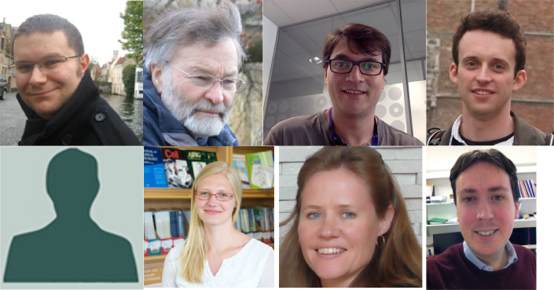

# Welcome!


We're based at [Cancer Research Uk Cambridge Institute](http://www.cruk.cam.ac.uk/), about 2 miles south of here

    


# Who's who 





## Top Row
- Mark
    + Bioinformatics Training Coordinator, Bioinformatics Core
    + Soon to be Bioinformatics Core Head at University of Sheffield
- Paul Edwards
    + Reader in Cancer Biology, Division of Cellular and Molecular Pathology
- Oscar
    + Senior Research Associate, Caldas lab (Breast Cancer Genomics)
- Geoff
    + Senior Research Associate, Markowetz (Systems Genetics of Cancer) and Brenton (Functional genomics of ovarian cancer)
    
## Second Row
- Matt
    + Bioinformatics Core Head
- Juliane
    + Senior Research Associate, Tavare lab (Statistics and Computational Biology )
- Cathy
    + Bioinformatics Training Facility, Administrator
- Paul Judge
    + Bioinformatics Training Facility, Sys Admin
    
Huge thanks too to Kelly O'Reilly (CRUK) for admin support 

# Who are you?

```{r echo=FALSE, message=FALSE,fig.width=12,fig.height=8}
library(dplyr)
library(ggplot2)
library(gridExtra)
ppl <- tbl_df(read.csv("../Summer School 2017 Attendees - Sheet1.csv"))
p1 <- ggplot(ppl, aes(x = Institute)) + geom_bar(fill=rgb(29,0,150,maxColorValue=255)) + coord_flip()
p2 <- ggplot(ppl, aes(x=Position)) + geom_bar(fill=rgb(236,0,140,maxColorValue=255)) + coord_flip()
p3 <- ggplot(ppl, aes(x=Gender,fill=Gender)) + geom_bar() + scale_fill_manual(values=c(rgb(29,0,150,maxColorValue=255),rgb(236,0,140,maxColorValue=255))) + coord_flip()
grid.arrange(p1,p2,p3,ncol=1)
```


# Admin

- Course runs 09:30 ~ 17:00 each day
    + Room open from 09:00 each day
- Lunch provided 12:30 - 13:30 each day
    + different room on the same campus, we'll take you there
- No fixed coffee and tea breaks
    + but you'll probably have noticed the coffee machine at the back
- Please refrain from using the coffee machine when someone is lecturing
    + you'll discover why when you use the machine!
- Workshop dinner on Thursday night at Downing College
    + We assume you're coming unless you've told us otherwise
    + Please let us know ***a.s.a.p*** if you won't be coming!
    


# About the Course - "Analysis of Cancer Genomes"

- You will (probably) not come away being an expert
- We cannot teach you everything about NGS data
    + plus, it is a fast-moving field
    + will cover a selection of tools / methods
- Whole genome and exome DNA-seq only
    + much of the initial processing is the same for other assays
    + see our [upcoming autumn school](http://www.cruk.cam.ac.uk/bioinformatics-autumn-school-2017) for details of RNA- and ChIP-seq
- However, we hope that you will
    + Understand how your data are processed
    + Be able to explore your data - no programming required
    + Understand the issues and compromises involved in current methods
    + Communicate more effectively with the Bioinformaticians dealing with your data
    + Increase confidence with R and Bioconductor
    + Know where to get help
    + Be able to explore new technologies, methods, tools as they come out
    + Meet your colleagues from other CRUK institutes
    + Have fun!
- All materials will be online after the course
    + tell your colleagues, friends!
    + you'll be able to take the data away with you
- The software used will also be available to you
    + more on this soon
    
    
# Course Outline

## Day 1

- Recap of R
- Overview of Cancer Genomics
- Overview of NGS data
- Hands-on experience with NGS data


## Day 2

- Theory of SNV-calling
- How SNV calls are represented
- Copy-number analysis

## Day 3

- Theory of Somatic calling
- Hands-on practice assessing and filtering Somatic calls
- Annotating and prioritizing calls

## Day 4

- Structural Variants (SVs)
- Methods for visualising SVs
- Interpreting SVs
- Dealing with collections of genomes
- Generating mutational signatures

## Day 5


- Bring your own data
- Finish-off exercises from previous day

## Disclaimer


> To consult the statistician after an experiment is finished is often merely to ask him to conduct a post mortem examination. He can perhaps say what the experiment died of.”. R.A. Fisher, 1938

If you haven't designed your experiment properly, then all the Bioinformatics we teach you won't help: Consult with your local statistician - preferably **not the day before your grant is due!!!!**

<iframe width="420" height="315" src="https://www.youtube.com/embed/Hz1fyhVOjr4" frameborder="0" allowfullscreen></iframe>

- We have some [materials](http://bioinformatics-core-shared-training.github.io/experimental-design/) you can look at


# About the data

We will use publicly-available datasets that you can take away with you at the end of the course

## HCC1143

A breast-cancer cell-line on which we have data available and has been used as part of a "*benchmarking*" dataset to evaluate different variant-callers


- http://www.pawefish.path.cam.ac.uk/BreastCellLineDescriptions/HCC1143.html
- https://cansar.icr.ac.uk/cansar/cell-lines/HCC1143/copy_number_variation/
- https://portal.gdc.cancer.gov/legacy-archive/search/f

# Choice of software

- Trade-off between what is easiest to use, and what would be used in practice
    + and what runs in a reasonable time
    + focus on tools that enable you to explore the data
    + mostly using R
    
- No conflicts of interest
    + we don't have any particular tools that we wish to plug
- You'll probably have to decided what "looks best" on your own data
  
# Distribution of software 

- When you return home, you'll probably want to try-out the tools on your own data
- We'll be using RStudio, which hopefully most of you will already have
- However, installing software can be challenging, even for those with many years of experience
- The [*Docker*](http://www.docker.com/) platform is becoming an increasingly-popular way of packaging and distributing software
    + The Sanger institute have wrapped their genome analysis pipeline in a *docker container* 
    + We have created one too for other software required for the course; ***CRUK Docker***


- We'll go through this at the end of the course

# Live note-taking and documentation

- We have an "etherpad" at https://public.etherpad-mozilla.org/p/2017-07-24-cancer-genomes
- Use this to ask questions during the talks
- We can post code snippets, links and corrections here too

