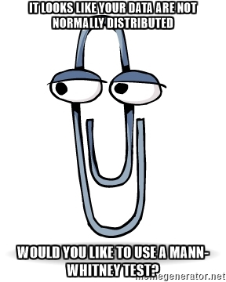

# A short introduction to R

## Outline

In this session, we introduce some of the fundamentals of the R language. 

Topics covered include:- 

- Creating variables
- Using Functions
- Vectors
- Data frame
- Subsetting data, the base R way
- Plotting 
- ***How to get help***

For a more detailed introduction, we suggest the following ***free*** resources

- [Solving Biological Problems with R](http://cambiotraining.github.io/r-intro/)
- [Introduction to Data Science with R](http://shop.oreilly.com/product/0636920034834.do)
- [Coursera course in R](http://blog.revolutionanalytics.com/2012/12/coursera-videos.html)
- [Beginners Introduction to R Statistical Software](http://bitesizebio.com/webinar/20600/beginners-introduction-to-r-statistical-software/)
- [R programming wiki](https://en.wikibooks.org/wiki/R_Programming)
- [Quick R](http://www.statmethods.net/)

# R basics

## Advantages of R


The R programming language is now recognised beyond the academic community as an effect solution for data analysis and visualisation. [Notable users of R](http://www.revolutionanalytics.com/companies-using-r) include:- 

- [Facebook](http://blog.revolutionanalytics.com/2010/12/analysis-of-facebook-status-updates.html),
- [google](http://blog.revolutionanalytics.com/2009/05/google-using-r-to-analyze-effectiveness-of-tv-ads.html),
- [Microsoft](http://blog.revolutionanalytics.com/2014/05/microsoft-uses-r-for-xbox-matchmaking.html) (who recently [invested](http://blogs.microsoft.com/blog/2015/01/23/microsoft-acquire-revolution-analytics-help-customers-find-big-data-value-advanced-statistical-analysis/) in a commerical provider of R)
- The [New York Times](http://blog.revolutionanalytics.com/2011/03/how-the-new-york-times-uses-r-for-data-visualization.html).
- [Buzzfeed](http://blog.revolutionanalytics.com/2015/12/buzzfeed-uses-r-for-data-journalism.html) use R for some of their serious articles and have made the code [publically available](https://buzzfeednews.github.io/2016-04-federal-surveillance-planes/analysis.html)
- The [New Zealand Tourist Board](https://mbienz.shinyapps.io/tourism_dashboard_prod/) have R running in the background of their website
- [Airbnb](https://medium.com/airbnb-engineering/using-r-packages-and-education-to-scale-data-science-at-airbnb-906faa58e12d)
- [The BBC](https://github.com/BBC-Data-Unit/music-festivals) makes code available for some of their stories (e.g. gender bias in music festivals)


Two Biostatiscians (later termed '*Forensic Bioinformaticians*') from M.D. Anderson used R extensively during their re-analysis and investigation of a Clinical Prognostication paper from Duke. The subsequent [scandal](https://www.youtube.com/watch?v=W5sZTNPMQRM) put Reproducible Research at the forefront of everyone's mind.

Keith Baggerly's talk on the subject is highly-recommended.

<iframe width="420" height="315" src="https://www.youtube.com/embed/7gYIs7uYbMo" frameborder="0" allowfullscreen></iframe>

## Support for R

- Online forums such as [Stack Overflow](http://stackoverflow.com/questions/tagged/r) regularly feature R
- [Blogs](http://www.r-bloggers.com/)
- Local [user groups](http://blog.revolutionanalytics.com/local-r-groups.html) 
- Documentation via `?` or `help.start()`
- Documentation for packages is found via the Packages tab in the bottom-right of RStudio.


## RStudio

- Rstudio is a free environment for R
- Convenient menus to access scripts, display plots
- Still need to use *command-line* to get things done
- Developed by some of the leading R programmers
- Used by beginners, and experienced users alike

To get started, you will need to install the [latest version of R](https://cran.r-project.org/) and [RStudio Desktop](https://www.rstudio.com/products/rstudio/download3/); both of which are ***free***. 

Once installed, you should be able to launch RStudio by clicking on its icon:-


## Bioconductor


Established in 2001 as a means of distributing tools for the analysis and comprehension of high-throughput genomic data in R. Initially focused on microarrays, but now has many tools for NGS data

- primary processing of NGS data nearly-always done in other languages
    + R is extensively-used for visualisation and interpretation once data are in manageable form

On the [Bioconductor website](www.bioconductor.org),. you will find

- Installation instructions
- [Course Materials](http://bioconductor.org/help/course-materials/)
- [Support forum](https://support.bioconductor.org/)
    + a means of communicating with developers and power-users
- [Example datasets](http://bioconductor.org/packages/release/BiocViews.html#___ExperimentData)
- [Annotation Resources](http://bioconductor.org/packages/release/BiocViews.html#___AnnotationData)
- Conferences
    + upcoming conference in Cambridge - December 2017


# Entering commands in R

- The traditional way to enter R commands is via the Terminal, or using the console in RStudio (bottom-left panel when RStudio opens for first time).
- However, for this course we will use a relatively new feature called *R-notebooks*.
- An R-notebook mixes plain text with R code

Markdown is a very simple way of writing a template to produce a pdf, HTML or word document. The compiled version of this document is available online and is more convenient to browse [https://bioinformatics-core-shared-training.github.io/cruk-summer-school-2017/Day1/Session2-Rnotes.nb.html](here).


- "chunks" of R code can be added using the *insert* option from the toolbar, or the CTRL + ALT + I shortcut
- Each line of R can be executed by clicking on the line and pressing CTRL and ENTER
- Or you can press the green triangle on the right-hand side to run everything in the chunk
- Try this now!
- The code might have different options which dictate how the output is displayed in the compiled document (e.g. HTML)
    + e.g. you might see `EVAL = FALSE` or `echo = FALSE`
    + you don't have to worry about this if stepping through the markdown interactively

```{r}
print("Hello World")

```

*This will be displayed in italic*

**This will be displayed in bold**


- this 
- is 
- a 
- list
    + this is a *sub-list*

You can also add hyperlinks, images and tables. More help is available through RStudio **Help -> Markdown Quick Reference**

At a basic level, we can use R as a calculator to compute simple sums with the `+`, `-`, `*` (for multiplication) and `/` (for division) symbols. 


Try adding some of your own calculations below....

```{r}
2 + 2
2 - 2
4 * 3
10 / 2


```

The answer is displayed at the console with a `[1]` in front of it. The `1` inside the square brackets is a place-holder to signify how many values were in the answer (in this case only one). We will talk about dealing with lists of numbers shortly...

In the case of expressions involving multiple operations, R respects the [BODMAS](https://en.wikipedia.org/wiki/Order_of_operations#Mnemonics) system to decide the order in which operations should be performed.

```{r}
2 + 2 *3
2 + (2 * 3)
(2 + 2) * 3


```


R is capable of more complicated arithmetic such as trigonometry and logarithms; like you would find on a fancy scientific calculator. Of course, R also has a plethora of statistical operations as we will see.


```{r}
pi
sin (pi/2)
cos(pi)
tan(2)
log(1)


```

We can only go so far with performing simple calculations like this. Eventually we will need to store our results for later use. For this, we need to make use of *variables*.

## Variables

A variable is a letter or word which takes (or contains) a value. We
use the assignment 'operator', `<-` to create a variable and store some value in it. 

```{r}
x <- 10
x
myNumber <- 25
myNumber


```
We also can perform arithmetic on variables using functions:

```{r}
sqrt(myNumber)
```

We can add variables together:
```{r}
x + myNumber
```


We can change the value of an existing variable:

```{r}
x <- 21
x
```

- We can set one variable to equal the value of another variable:

```{r}
x <- myNumber
x
```

When we are feeling lazy we might give our variables short names (`x`, `y`, `i`...etc), but a better practice would be to give them meaningful names. There are some restrictions on creating variable names. They cannot start with a number or contain characters such as `.`, `_`, '-'. Naming variables the same as in-built functions in R, such as `c`, `T`, `mean` should also be avoided.


## Functions

**Functions** in R perform operations on **arguments** (the inputs(s) to the function). We have already used:

```{r}
sin(x)
```

this returns the sine of x. In this case the function has one argument: **x**. 

- Arguments are always contained in parentheses -- curved brackets, **()** -- separated by commas.


- Arguments can be named or unnamed, but if they are unnamed they must be ordered (we will see later how to find the right order). The names of the arguments are determined by the author of the function and can be found in the help page for the function. When testing code, it is easier and safer to name the arguments. 

`rnorm` is a function that will generate a series of values from a *normal distribution*. In order to use the function, we need to tell R how many values we want

```{r}
rnorm(n=10)
```

The normal distribution is defined by a *mean* (average) and *standard deviation* (spread). However, in the above example we didn't tell R what mean and standard deviation we wanted. So how does R know what to do? All arguments to a function and their default values are listed in the help page

(*N.B sometimes help pages can describe more than one function*)

```{r eval=FALSE}
?rnorm
```

The help page is often the best way to find out about a function. Otherwise, **google is your friend**.

In this case, we see that the defaults for mean and standard deviation are 0 and 1. We can change the function to generate values from a distribution with a different mean and standard deviation using the `mean` and `sd` *arguments*. It is important that we get the spelling of these arguments exactly right, otherwise R will an error message, or (worse?) do something unexpected.

```{r}
rnorm(n=10, mean=2,sd=3)
rnorm(10, 2, 3)


```

In the example, `rnorm` is outputting a series of numbers, which is called a *vector* in R and is the most-fundamental data-type.


## Packages in R

So far we have used functions that are available with the *base* distribution of R; the functions you get with a clean install of R. The open-source nature of R encourages others to write their own functions for their particular data-type or analyses.

Packages are distributed through *repositories*. The most-common ones are CRAN and Bioconductor. CRAN alone has many thousands of packages.

The **Packages** tab in the bottom-right panel of RStudio lists all packages that you currently have installed. Clicking on a package name will show a list of functions that available once that package has been loaded. The `library` function is used to load a package and make it's functions / data available in your current R session. *You need to do this every time you load a new RStudio session*. 


```{r eval=FALSE}
library(RColorBrewer)
```

There are functions for installing packages within R. If your package is part of the main **CRAN** repository, you can use `install.packages`.

- Here, `tidyr` is a useful package for cleaning and reshaping data:-

```{r eval=FALSE}
install.packages("tidyr")
```

*Bioconductor* packages have their own install script, which you can download from the Bioconductor website

```{r eval=FALSE}
source("http://www.bioconductor.org/biocLite.R")
biocLite("affy")
```

A package may have several *dependancies*; other R packages from which it uses functions or data types (re-using code from other packages is strongly-encouraged). If this is the case, the other R packages will be located and installed too.

**So long as you stick with the same version of R, you won't need to repeat this install process.**

# Dealing with data

We are going to explore some of the basic features of R using data from the [gapminder](https://www.gapminder.org/data/) project, which have been bundled into an [R package](https://github.com/jennybc/gapminder). These data give various indicator variables for different countries around the world (life expectancy, population and Gross Domestic Product). We have saved these data as a `.csv` file to demonstrate how to import data into R.

You can download these data [here](https://raw.githubusercontent.com/bioinformatics-core-shared-training/r-intermediate/master/gapminder.csv). Right-click the link and save to somewhere on your computer that you wish to work from.

## The working directory

Like other software (Word, Excel, Photoshop....), R has a default location where it will save files to and import data from. This is known as the *working directory* in R. You can query what R currently considers its working directory by doing:-

```{r eval=FALSE}
getwd()
```

*N.B. Here, a set of open and closed brackets `()` is used to call the `getwd` function with no arguments.*

We can also list the files in this directory with:-

```{r}
list.files()
```

Any `.csv` file in the working directory can be imported into R by supplying the name of the file to the `read.csv` function and creating a new variable to store the result. A useful sanity check is the `file.exists` function which will print `TRUE` is the file can be found in the working directory.

```{r}
file.exists("gapminder.csv")
```

If the file we want to read is not in the current working directory, we will have to write the path to the file; either *relative* to the current working directory (e.g. the directory "up" from the current working directory, or in a sub-folder), or the full path. In an interactive session, you can do use `file.choose` to open a dialogue box. The path to the the file will then be displayed in R.

```{r eval=FALSE}
myfile <- file.choose()
myfile
```


```{r eval=FALSE}
myfile <- "/home/participant/Course_Materials/Day1/gapminder.csv"
```


Assuming the file can be found, we can use `read.csv` to import. Other functions can be used to read tab-delimited files (`read.delim`) or a generic `read.table` function. A data frame object is created.

- `read.delim` has lots of options to control how to import the data, including skipping lines in the files. See `?read.table`

- If you get an error saying *Error in file(file, "rt") : cannot open the connection*, you might need to change your working directory or make sure the file name is typed correctly (R is *case-sensitive*)

```{r}
gapminder <- read.csv("gapminder.csv")
gapminder
```

- N.B. The latest version of RStudio (> 1.0.44) provides the option to import data from the File menu. Try ***File*** -> ***Import Dataset*** -> ***From Csv***.
    + not really recommended for best practice, but it should help get you started

The data frame object in R allows us to work with "tabular" data, like we might be used to dealing with in Excel, where our data can be thought of having rows and columns. The values in each column have to all be of the same type (i.e. all numbers or all text).

**Disclaimer** If you are trying to read your own data, and encounter an error at this stage, you may need to consider if your data are in the *correct form for analysis*. Like most programming languages, R will struggle if your spreadsheet has been heavily formatted to include colours, formulas and special formatting. 

These references will guide you through some of the pitfalls and common mistakes to avoid when formatting data

- [Formatting data tables in Spreadsheets](http://www.datacarpentry.org/spreadsheet-ecology-lesson/01-format-data.html)
- [Data Organisation tutorial by Karl Broman](http://kbroman.org/dataorg/)
- [The Quartz guide to bad data](https://github.com/Quartz/bad-data-guide/blob/master/README.md)

In RStudio , you can view the contents of the data frame we have just created. This is useful for interactive exploration of the data, but not so useful for automation and scripting and analyses.

```{r eval=FALSE}
View(gapminder)
```

We should always check the data frame that we have created. Sometimes R will happily read data using an inappropriate function and create an object without raising an error. However, the data might be unsuable. Consider:-

```{r}
test <- read.delim("gapminder.csv")
dim(test)
```


We can access the columns of a data frame by knowing the column name. 
***TIP*** Use auto-complete with the ***TAB*** key to get the name of the column correct

```{r eval=FALSE}
gapminder$country
```


A vector (1-dimensional) is returned, the length of which is the same as the number of rows in the data frame. The vector could be stored as a variable and itself be subset or used in further calculations

```{r}
countries <- gapminder$country

```


The `summary` function is a useful way of summarising the data containing in each column. It will give information about the *type* of data (remember, data frames can have a mixture of numeric and character columns) and also an appropriate summary. For numeric columns, it will report some stats about the distribution of the data. For categorical data, it will report the different *levels*.

```{r}
summary(gapminder)
```


******
******
******

### Exercise

- Create new variables for the life expectancy and population columns
    + round the life expectancy to the nearest whole number
    + modify the population variable so that the population size is given in millions of people
    + what is the maximum life expectancy observed?
    + what is the smallest population observed?  
    + HINT:- `min`, `max`, `round`.....
    
******
******
******

```{r}

### Your answer here ###

```


## Subsetting rows and columns

A data frame can be subset using square brackes`[]` placed after the name of the data frame. As a data frame is a two-dimensional object, you need both a *row* and *column* index.

```{r eval=FALSE}
gapminder[1,2]
gapminder[2,1]
gapminder[c(1,2,3),1]
gapminder[c(1,2,3),c(1,2,3)]


```

***Note that the data frame is not altered*** we are just seeing what a subset of the data looks like and not changing the underlying data. If we wanted to do this, we would need to create a new variale.

```{r eval=FALSE}
gapminder
```

Should we wish to see all rows, or all columns, we can neglect either the row or column index

```{r eval=FALSE}
gapminder[1,]
gapminder[,1]


```

The indices can be more complicated R expressions containing multiple values

```{r eval=FALSE}
gapminder[1:3,1:2]
gapminder[seq(1,1704,length.out = 10),1:4]


```


A common shortcut is `head` which prints the first six rows of a data frame.
   
```{r}
head(gapminder)
```

When subsetting entire rows ***you need to remember the , after the row indices***. If you fail to do so, R may still return a result. However, it probably won't be what you expected. Look what happens if you wanted to the first three rows but typed the following command

```{r eval=FALSE}
gapminder[1:3]
```


We can also create new columns, or alter existing ones

- Using an assignment operator `<-` we can assign the value of a particular column to be vector
    + if the column doesn't exist, it will be created
    + the vector should be the same length as the number of rows in the data frame

```{r}
gapminder$popInMillions <- gapminder$pop / 1000000
gapminder$lifeExp <- round(gapminder$lifeExp,1)
gapminder

```

## Filtering rows

Rather than selecting rows based on their *numeric* index (as in the previous example) we can use what we call a *logical test*. This is a test that gives either a `TRUE` or `FALSE` result. When applied to subsetting, only rows with a `TRUE` result get returned.

```{r}
myvec <- c("A","B","C","D")
x <- c(TRUE, TRUE,FALSE,TRUE)
myvec[x]
x <- c(FALSE, FALSE,FALSE,TRUE)

```


For example we could compare the `lifeExp` variable to 40. The result is a *vector* of `TRUE` or `FALSE`; one for each row in the data frame

```{r eval=FALSE}
gapminder$lifeExp < 40

```

This R code can be put inside the square brackets to select rows of interest (those observations where the life expectancy variable is less than 40). 

```{r}
gapminder[gapminder$lifeExp < 40, ]
```


The `,` is important as this tells R to display all columns. If we wanted a subset of the columns we would put their indices after the `,`

```{r}
gapminder[gapminder$lifeExp < 40, 1:4]
```


Using the column names is also valid

```{r }
gapminder[gapminder$lifeExp < 40, c("country", "continent","year")]
```


Testing for equality can be done using `==`. This will only give `TRUE` for entries that are *exactly* the same as the test string. 

```{r}
gapminder[gapminder$country == "Zambia",]

```

N.B. For partial matches, the `grep` function and / or *regular expressions* (if you know them) can be used.

```{r} 
gapminder[grep("land", gapminder$country),]

```


There are a couple of ways of testing for more than one text value. The first uses an *or* `|` statement. i.e. testing if the value of `country` is `Zambia` *or* the value is `Zimbabwe`.

The `%in%` function is a convenient function for testing which items in a vector correspond to a defined set of values.

```{r}
gapminder[gapminder$country == "Zambia" | gapminder$country == "Zimbabwe",]
gapminder[gapminder$country %in% c("Zambia","Zimbabwe"),]
```


Similar to *or*, we can require that both tests are `TRUE` by using an *and* `&` operation. e.g. which years in Zambia had a life expectancy less than 40

```{r}
gapminder[gapminder$country == "Zambia" & gapminder$lifeExp < 40,]
```

******
******
******

### Exercise

- Print the contents of the row in the data frame that contains the entry with the highest population?
- Print the contents of the row in the data frame that contains the entry with the lowest life expectancy?
- A data frame of countries with a population less than a million in the year 2002, that are not in Africa?
    + you may need to do some googling to find out how to do "not equal" in R
(Optional)
- What country has the longest name? Print all the rows containing data for this country
   + HINT: investigate the `nchar` function

******
******
******

```{r}

### Your answer here ###

```


## Ordering and sorting

A vector can be returned in sorted form using the `sort` function.

```{r eval=FALSE}
sort(countries)
sort(countries,decreasing = TRUE)
```

However, if we want to sort an entire data frame a different approach is needed. The trick is to use `order`. Rather than giving a sorted set of *values*, it will give sorted *indices*. These indices can then be used for a subset operation.

```{r}
leastPop <- gapminder[order(gapminder$pop),]
head(leastPop)
```

We can even order by more than one condition

```{r eval=FALSE}
gapminder[order(gapminder$year, gapminder$country),]
```


A final point on data frames is that we can export them out of R once we have done our data processing. 

```{r}
byWealth <- gapminder[order(gapminder$gdpPercap,decreasing = TRUE),]
head(byWealth)
write.csv(byWealth, file="dataOrderedByWealth.csv")
```


# Plotting and stats (in brief!)

All your favourite types of plot can be created in R


- Simple plots are supported in the *base* distribution of R (what you get automatically when you download R). 
    + `boxplot`, `hist`, `barplot`,... all of which are extensions of the basic `plot` function
- Many different customisations are possible
    + colour, overlay points / text, legends, multi-panel figures
- ***You need to think about how best to visualise your data*** 
    + http://www.bioinformatics.babraham.ac.uk/training.html#figuredesign
- R cannot prevent you from creating a plotting disaster: 
    + http://www.businessinsider.com/the-27-worst-charts-of-all-time-2013-6?op=1&IR=T
- References..
    + [Introductory R course](http://cambiotraining.github.io/r-intro/)
    + [Quick-R](http://www.statmethods.net/graphs/index.html)
    + [More advanced plotting; ggplot2](http://bioinformatics-core-shared-training.github.io/r-intermediate/)
    
Plots can be constructed from vectors of numeric data, such as the data we get from a particular column in a data frame.

## Basic Plot types

- A histogram is a common choice if we want to visualise the distribution of a numeric variables

```{r}
hist(gapminder$lifeExp)
```

Scatter plots of two variables require two arguments; one for the `x` and one for the `y` axis.

```{r}
plot(gapminder$pop,gapminder$lifeExp)
```


Barplots are commonly-used for counts of categorical data

- Let's say we want to know how many countries there are 
- `table` will give us the total number of times each country is observed
    + but the set of countries is repeated for each year
    
```{r}
table(gapminder$continent)
table(gapminder$continent[gapminder$year==2002])
barplot(table(gapminder$continent[gapminder$year==2002]))
```

Boxplots are good for visualising and comparing distributions. Here the `~` symbol sets up a formula, the effect of which is to put the categorical variable on the `x` axis and continuous variable on the `y` axis.

```{r}
boxplot(gapminder$gdpPercap ~ gapminder$continent)
```

*Lots* of customisations are possible to enhance the appaerance of our plots. Not for the faint-hearted, the help pages `?plot` and `?par` give the full details. In short,

- Axis labels, and titles can be specified as character strings. 

- R recognises many preset names as colours. To get a full list use `colours()`, or check this [online reference](http://www.stat.columbia.edu/~tzheng/files/Rcolor.pdf).
    + can also use `*R*ed, *G*reen, *B*lue values; which you might get from a paint program
- Plotting characters can be specified using a pre-defined number:-


Putting it all together.

```{r}
plot(gapminder$pop,gapminder$lifeExp,pch=16,
     col="red",ylab="Life Expectancy",
     xlab="Population",main="Life Expectancy trend with population")
```


The same customisations can be used for various plots:-

```{r}
boxplot(gapminder$gdpPercap ~ gapminder$continent,col=c("red","orange","green","blue","purple"),
        main="GDP per-continent",
        xlab="Continent",
        ylab="GDP")
```

******
******
******

## Exercise

- First, create a subset of observations from the year **1952**
- Do countries with a higher GDP tend to have a higher life expectancy?
    + use a scatter plot to find out
- Was there an overall difference in life expectancy between continents in this year?
    + use a boxplot to find out

******
******
******

```{r}
## Your answer here##


```


Plots can be exported by the ***Plots*** tab in RStudio, which is useful in an interactive setting. However, one can also save plots to a file calling the `pdf` or `png` functions before executing the code to create the plot. 
 

 
```{r}
pdf("myLittlePlot.pdf")
boxplot(gapminder$gdpPercap ~ gapminder$continent,col=c("red","orange","green","blue","purple"),
        main="GDP per-continent",
        xlab="Continent",
        ylab="GDP")
dev.off()
```

Any plots created in-between the `pdf(..)` and `dev.off()` lines will get saved to the named file. The `dev.off()` line is very important; without it you will not be able to view the plot you have created. `pdf` files are useful because you can create documents with multiple pages. Moreover, they can be imported into tools such as Adobe Illustrator to be incorporated with other graphics. 

- Often it is quicker to save a plot as a pdf and tinker in Illustrator rather than getting R to do exactly what you want

```{r}
pdf("gapminder-plots.pdf")
plot(gapminder$pop,gapminder$lifeExp,pch=16,
     col="red",ylab="Life Expectancy",
     xlab="Population",main="Life Expectancy trend with population")
boxplot(gapminder$gdpPercap ~ gapminder$continent,col=c("red","orange","green","blue","purple"),
        main="GDP per-continent",
        xlab="Continent",
        ylab="GDP")
dev.off()
```


## The canvas model

It is important to realise that base graphics in R uses a *"canvas model"* to create graphics. We can only overlay extra information on-top of an exising plot and cannot "undo" what is already drawn.

Let's suppose we want to compare the relationship between GDP and Life Expectancy in 1952 and 2002

- A variety of functions can be used to add extra data / annotations to a plot. e.g.
    - `points`
    - `lines`
    - `text`
    - `legend`

```{r}
oldData <- gapminder[gapminder$year == 1952,]
oldData
```

```{r}
newData <- gapminder[gapminder$year == 2002,]
newData
newData
```

We can start by plotting the life expectancy of the 1952 observations as red dots.

```{r}
plot(oldData$gdpPercap, oldData$lifeExp,col="red",
     pch=16,
     xlab="GDP",
     ylab="Life Expectancy")
```

The `points` function can be used to addt extra points corresponding to 2002 countries on the existing plot. 

- Something doesn't look right though...

```{r}
plot(oldData$gdpPercap, oldData$lifeExp,col="red",
     pch=16,
     xlab="GDP",
     ylab="Life Expectancy")

points(newData$gdpPercap, newData$lifeExp,col="blue",
     pch=16,
     xlab="GDP",
     ylab="Life Expectancy")
```


The problem here is that the initial limits of the y axis were defined using the life expectancy range of the 1952 data. We can only add points to the existing plotting window, so anycountries with life expectancy outside this range in 2002 will not get displayed.

```{r}
range(oldData$lifeExp)
range(oldData$gdpPercap)
range(newData$lifeExp)
range(newData$gdpPercap)

```

We can define the axes when we create the plot using `xlim` and `ylim`.

```{r}
plot(oldData$gdpPercap, oldData$lifeExp,col="red",
     pch=16,
     xlab="GDP",
     ylab="Life Expectancy",
     xlim=c(0,1.1e5),ylim=c(30,90))
points(newData$gdpPercap, newData$lifeExp,col="blue",pch=16)
```

A legend can also be added using the `legend` function

- You can specify a set of coordinates where you want to display the legend, but there are also shortcuts

```{r}
plot(oldData$gdpPercap, oldData$lifeExp,col="red",
     pch=16,
     xlab="GDP",
     ylab="Life Expectancy",
     xlim=c(0,1.1e5),ylim=c(30,90))
points(newData$gdpPercap, newData$lifeExp,col="blue",pch=16)
legend("topright", legend=c(1952,2002),col=c("red","blue"),pch=16)
```

The `text` function works in a similar way to `points`

- You give it the set of x and y coordinates you want to plot
    + plus also a set of labels

```{r}
plot(oldData$gdpPercap, oldData$lifeExp,col="red",
     pch=16,
     xlab="GDP",
     ylab="Life Expectancy",
     xlim=c(0,1.1e5),ylim=c(30,90))
points(newData$gdpPercap, newData$lifeExp,col="blue",pch=16)
text(c(2e04,4e04),c(40,40),labels = c("Hello","World"))

legend("topright", legend=c(1952,2002),col=c("red","blue"),pch=16)

```


******
******
******

## Exercise

- What is that outlier on the x axis (GDP)?
    + use a logical test to find out
- Use the text function to annotate the plot with the corresponding country name

```{r}
plot(oldData$gdpPercap, oldData$lifeExp,col="red",
     pch=16,
     xlab="GDP",
     ylab="Life Expectancy",
     xlim=c(0,1.1e5),ylim=c(30,90))
points(newData$gdpPercap, newData$lifeExp,col="blue",pch=16)

## Some code here to find the outlier here...

```

******
******
******


    


### Specifying a vector of colours

- So far we have used a vector of length 1 to specify the colours
    + e.g. `col="red"
- We needn't have to do this. The `col` argument can have multiple values
    + the values will get "re-cycled" in order to complete the plot
- In the code below we use either `red` or `blue` to colour the points
    + only one `plot` command is used
    + since 1952 and 2002 alernate in the data frame, the years will be plotted `red` or `blue` accordingly
 
```{r}
subset <- gapminder[gapminder$year %in% c(1952, 2002),]
subset
plot(subset$gdpPercap, subset$lifeExp,
     xlab="GDP",
     ylab="Life Expectancy",
     xlim=c(0,1.1e5),ylim=c(30,90),
     col=c("red","blue"),
     pch=c(16,17))

```


A useful trick to make plots look nice is to take advantage of pre-existing colour palettes in R. The `RColorBrewer` package is a useful package for such palettes; many of which are friendly to those with visual impairments.

```{r}
library(RColorBrewer)
display.brewer.all(colorblindFriendly = TRUE)

```

The `brewer.pal` function can return the names of `n` colours from one of the pre-defined palettes to be used as a `col` argument to a plotting function.

```{r}
boxplot(gapminder$gdpPercap ~ gapminder$continent,col=brewer.pal(5,"Set1"),
        main="GDP per-continent",
        xlab="Continent",
        ylab="GDP")
```

## Plot Layouts

A further solution to the problem of comparing different years might be to have two plots arranged side-by-side

- One option that can be set with `par` is *m*ultiple *f*igures by *row*
    + argument is a vector containing number of columns and rows in the figure

```{r}
par(mfrow=c(1,2))
plot(oldData$gdpPercap, oldData$lifeExp,col="red",
     pch=16,
     xlab="GDP",
     ylab="Life Expectancy",
     xlim=c(0,1.1e5),ylim=c(30,90))

plot(newData$gdpPercap, newData$lifeExp,col="blue",
     pch=16,
     xlab="GDP",
     ylab="Life Expectancy",
     xlim=c(0,1.1e5),ylim=c(30,90))

```

Don't need to have the same kind of plot in each cell.


```{r}
par(mfrow=c(1,2))
plot(oldData$gdpPercap, oldData$lifeExp,col="red",
     pch=16,
     xlab="GDP",
     ylab="Life Expectancy",
     xlim=c(0,1.1e5),ylim=c(30,90))

boxplot(oldData$lifeExp ~ oldData$continent)

```

There is plenty more to know about plotting that we don't have time to cover

- adding lines of best fit with `abline`
- adding grids with `grid`
- control over axis appearance and labels with `axis`
- for more inspiration, see the [R graph gallery](http://www.r-graph-gallery.com/)

## (***Optional***)

## Statistical Testing

We can't really have a run-through of the R language without at least *mentioning* statistics! However, like plotting it is a vast field. The main challenges are putting your data in the correct format (which we have covered here), and deciding which test to use (**which R will not advise you on!**) 



- If you have some background in statistics you can see this course from the [Babraham Institute Bioinformatics Core](http://www.bioinformatics.babraham.ac.uk/training/R_Statistics/Introduction%20to%20Statistics%20with%20R.pdf) about how to perform statistical testing in R.
- If you need a more basic grounding in which statistical test to use, you can see this course from [CRUK Cambridge Institute](http://bioinformatics-core-shared-training.github.io/IntroductionToStats/)
  
The `t.test` function is probably the most fundamental statistical testing function in R, and can be adapted to many different situations. Full details are given in the help page `?t.test`. Lets consider we have two vectors of normally-distributed data that we can visualise using a boxplot.

```{r}
x <- rnorm(20)
y <- rnorm(20, 5,1)
df <- data.frame(x,y)
boxplot(df)
```

The output from `t.test` can be used to judge if there is a statistically-significant difference in means:-

```{r}
t.test(x,y)
```

If our data were paired we could set the argument `paired=TRUE` to use a different flavour of the test

```{r}
t.test(x,y,paired = TRUE)
```

Similarly, if our data have different variances we can adjust the test accordingly:-

```{r}
x <- rnorm(20)
y <- rnorm(20, 5,4)
df <- data.frame(x,y)
boxplot(df)
t.test(x,y,var.equal = FALSE)
```

Were our data not normally-distributed we could use `wilcox.test`, for example.  Fortunately, most statistical tests can be accessed in a similar manner, so it is easy to switch between using different tests provided your data are in the correct format. To re-iterate, the skill is in choosing which test is appropriate.

```{r}
wilcox.test(x,y,var.equal = FALSE)
```

