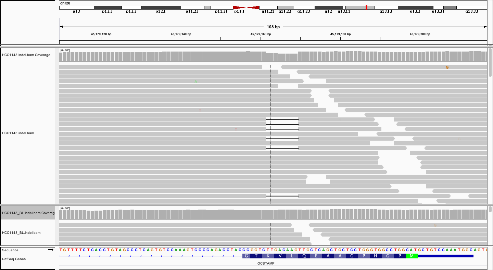

```{r include=FALSE}
library(tidyr)
library(dplyr)
library(highcharter)
library(DT)
source("plots.R")
```

## Outline

* Functional impact of indels in cancer

* Short exercise: exploring TGF-beta receptor 2 indels in COSMIC

* Indel calling tools

* How well do somatic indel callers perform?

* Some characteristics of indels called in HCC1143


## Indels

* Range from 1 to 10,000 bases but here we are mostly considering small indels of 1 - 50 bp

* Lower frequency than SNPs except near highly repetitive regions, including homopolymers and microsatellites


## Somatic frameshift deletion {#less_space_after_title}




## Functional impact

* 1000 Genomes Project loss of function indel variants in each individual <span style="font-size: 75%">[[Nature 2010](http://www.ncbi.nlm.nih.gov/pubmed/20981092)]</span>

    * 340 - 400 premature stop codons, split site disruptions and frame shifts

    * 250 - 300 genes affected

<div style="line-height: 50%;"><br></div>

* <span>Frameshift mutations have an impact in several diseases (cystic fibrosis, HIV, Crohn's disease, Tay-Sachs)</span>

<div style="line-height: 50%;"><br></div>

* Colorectal cancer

    * 15% of colorectal tumours characterized by microsatellite instability (MSI), caused by defective mismatch repair

    * DNA slippage within coding sequences induces frameshift mutations resulting in truncated, functionally inactive proteins (TGFBR2 and BAX frequently targeted genes)

<div style="line-height: 50%;"><br></div>

* <span>[COSMIC](http://cancer.sanger.ac.uk/cosmic) database of somatic mutations in cancer has several examples of frameshift mutations in tumour suppressors, such as TP53, PTEN, BRCA1/2 and TGFBR2</span>


## Indels in cancer genome sequencing projects

* In-depth analyses in large cohort studies typically focus on substitutions or copy number aberrations/rearrangements

    * <span>Indels often just catalogued</span>

<div style="line-height: 50%;"><br></div>

* Recent Sanger Institute paper on 560 Breast Cancers searched for novel indel drivers in non-coding regions with significant recurrence (functional regulatory elements)<span style="font-size: 75%">[[Nik-Zainal et al., Nature 2016](https://www.ncbi.nlm.nih.gov/pubmed/27135926)]</span>

    * <span>Previously looked at association of indels with mutational signatures <span style="font-size: 75%">[[Nik-Zainal et al., Cell 2012](https://www.ncbi.nlm.nih.gov/pubmed/22608084)]</span></span>

<div style="line-height: 50%;"><br></div>

* <span>Application of 1000 Genomes Project data to cancer genomics showed that genes linked with cancer showed stronger selection against indels <span style="font-size: 75%">[[Science 2013](https://www.ncbi.nlm.nih.gov/pubmed/27135926)]</span></span>


## Exercise -- Exploring indels in TGF-beta receptor 2

* Search for TGFBR2 in the [COSMIC](http://cancer.sanger.ac.uk/cosmic) website

* Explore the breakdown of mutation types for samples with TGFBR2 mutations (Distribution tab)

    * _What proportion of samples have frameshift indels?_

    * _What size are most of these indels?_

* Look at the location of the indels within the gene (Gene View tab)

    * _What is immediately striking about this?_

    * Zoom in on the most frequently observed indel and turn on the DNA sequence display

    * _What is the sequence context at this indel?_

* Click on the c.374delA deletion to access details of the cancers in which this mutation was observed

    * <span>_Which cancer type is this mutation most commonly seen in?_</span>


## Indel calling tools

* Several tools call both SNVs and indels particularly those tools that perform local reassembly or realignment around likely indel sites

    * <span style="color: #2e3192">VarScan2</span>
    * <span style="color: #2e3192">Strelka</span>
    * <span style="color: #2e3192">MuTect2</span>
    * <span style="color: #2e3192">VarDict</span>

<div style="line-height: 50%;"><br></div>

* <span style="color: #2e3192">**Pindel**<span> is the somatic indel caller used in the Sanger CGP pipeline

    * Uses a pattern growth algorithm for unmapped paired end reads anchored to mapped mate

    * Can identity short and medium sized indels up to 10kb

    * Modified version used in CGP pipeline that takes advantage of additional alignment information available for longer reads (>100 bases) and can make use of split read alignments


## Identifying indels can be tricky

* Many indels exist in long homopolymers and short sequence repeats (di-nucleotides, tri-nucleotides, etc.)

* Not easy to distinguish between true variants caused by replication slippage and sequencing errors

    * <span><span style="color: #2e3192">Strelka</span> filters out indels within repeats above certain length</span>

<div style="line-height: 50%;"><br></div>

* <span>Homopolymer A/T indels are major source of low quality indel calls<span style="font-size: 75%">[[Fang et al., Genome Med. 2014](https://www.ncbi.nlm.nih.gov/pubmed/25426171)]</span></span>

<div style="line-height: 50%;"><br></div>

* Benchmark exercises show that indels are harder to call accurately that SNVs

    * <span>ICGC medulloblastoma benchmark study <span style="font-size: 75%">[[Alioto et al., Nat Commun. 2015](http://www.ncbi.nlm.nih.gov/pubmed/26647970)]</span></span>


## ICGC MB99 benchmark

```{r echo=FALSE}
mb99 <- read.delim("icgc_benchmark_mb99.txt", stringsAsFactors = FALSE, check.names = FALSE)

scatterPlot(
  mb99 %>%
    transmute(
      x = Precision,
      y = Recall,
      series = ifelse(grepl("^MB", Group), "Submissions",
               Group),
      tooltip = paste(
        Group,
        "<br>TP: ", TP, ", FP: ", FP, ", FN: ", (337 - TP),
        "<br>Precision: ", Precision,
        "<br>Recall: ", Recall,
        "<br>Balanced accuracy: ", Balanced_accuracy,
        sep = ""
      )
    ),
  series = c(
    "Ensemble 2 from 3",
    "Strelka + MuTect2 + Pindel",
    "Strelka + Pindel",
    "MuTect2",
    "Pindel",
    "Strelka (no repeat filter)",
    "Strelka",
    "Submissions"
  ),
  colours = c(
    "#1f1f7a",
    "#2f2fb6",
    "#5d5dd5",
    "#73e600",
    "#ff0066",
    "#ff9900",
    "#ffb84d",
    "#8fc1ef"
  ),
  visible = c(FALSE, FALSE, FALSE, FALSE, FALSE, FALSE, FALSE, TRUE),
  sizes = c(6.0, 6.0, 6.0, 6.0, 6.0, 6.0, 6.0, 4.5),
  xLabel = "Precision",
  yLabel = "Recall",
  xmin = 0.0, xmax = 1.0,
  ymin = 0.0, ymax = 1.0,
  yLine = 312 / 337, yLineColour = "#696969"
)
```


## Indels in HCC1143

```{r echo=FALSE}
insertion_sizes <- scan("HCC1143.insertion_sizes.txt")
deletion_sizes <- scan("HCC1143.deletion_sizes.txt")

number_of_insertions <- length(insertion_sizes)
number_of_deletions <- length(deletion_sizes)
number_of_indels <- number_of_insertions + number_of_deletions

insertion_size_counts <- count(data_frame(size = insertion_sizes), size)
deletion_size_counts <- count(data_frame(size = deletion_sizes), size)

counts <- data_frame(size = 1:30) %>%
  left_join(insertion_size_counts, by = "size") %>%
  rename(insertions = n) %>%
  left_join(deletion_size_counts, by = "size") %>%
  rename(deletions = n) %>%
  gather(series, count, -size) %>%
  select(series, category = size, count)

barPlot(
  counts,
  height = 450,
  xLabel = "Size (bp)",
  series = c("insertions", "deletions"),
  colours = c("#79b4ec", "#ff3385"),
  legendBorderWidth = 0
)
```

<span style="font-size: 85%">Total of `r number_of_insertions` somatic insertions and `r number_of_deletions` somatic deletions called by Pindel.</span>


## Short sequence repeat expansions/contractions in HCC1143

```{r echo=FALSE}
repeat_expansion_contraction <- read.delim("repeat_expansion_contraction.txt", stringsAsFactors = FALSE, check.names = FALSE)

number_of_poly_at <- repeat_expansion_contraction %>%
  filter(seq %in% c("A", "T")) %>%
  summarize_at(vars(n), funs(sum))

repeat_expansion_contraction <- repeat_expansion_contraction %>%
  select(series = type, category = seq, count = n)

barPlot(
  repeat_expansion_contraction,
  height = 450,
  colours = c("#79b4ec", "#ff3385"),
  legendBorderWidth = 0
)
```

<span style="font-size: 85%">`r number_of_poly_at` hompolymer A/T indels (`r sprintf("%.0f", 100.0 * number_of_poly_at / number_of_indels)`% of all indels), almost all of which are 1-bp insertions or deletions.</span>

