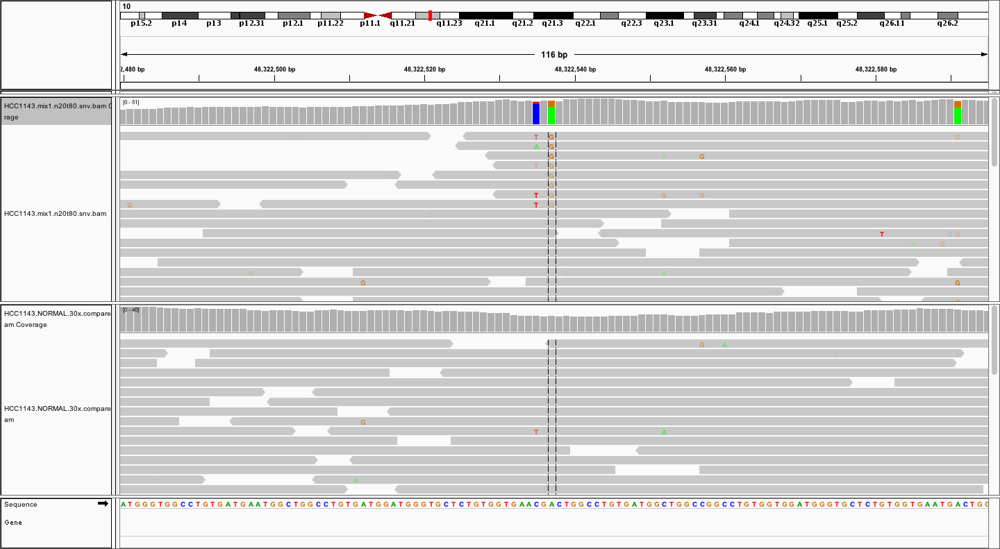
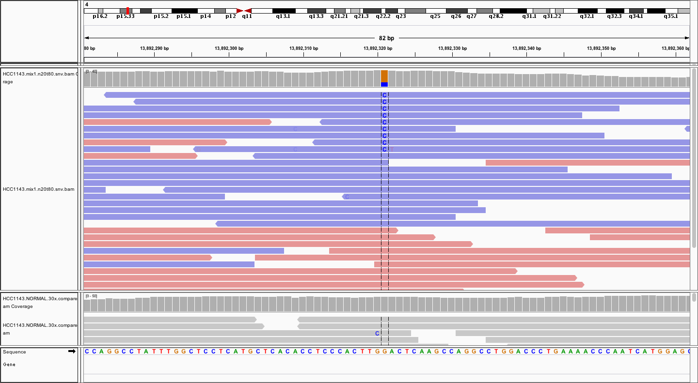
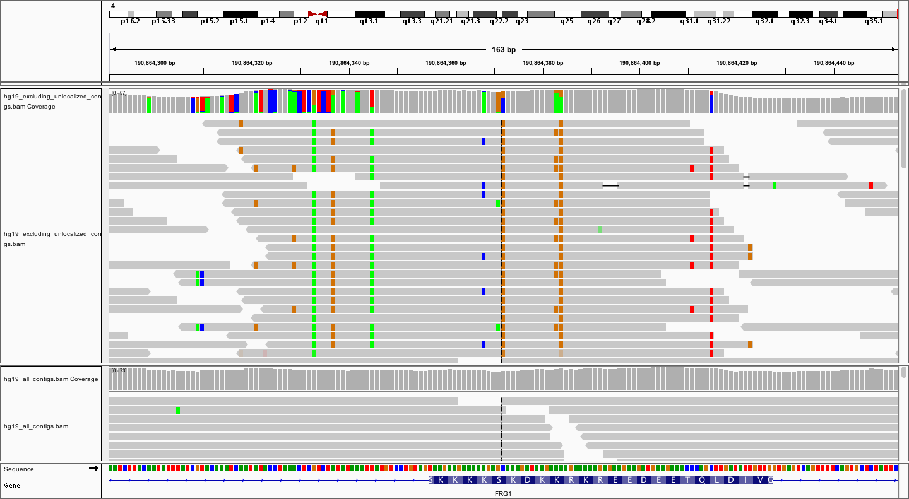
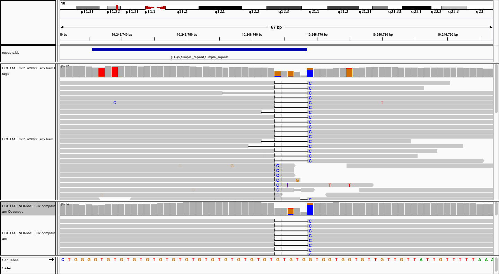
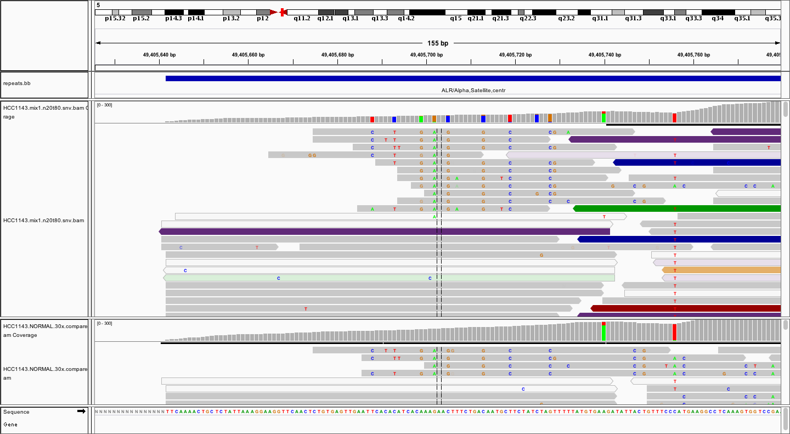

```{r include=FALSE}
library(tidyr)
library(dplyr)
library(highcharter)
library(DT)
source("plots.R")
```


## Outline

* What factors complicate somatic SNV calling and why is filtering necessary?

* CaVEMan filters

* Metric-based approach to filtering false positives

* Other approaches to filtering (panel of normals, ensemble calling)

* Benchmarks for assessing SNV calling and filtering


## Recap: several factors complicate somatic SNV calling

* <span style="color: #2e3192">**Low cellularity**</span> (tumour DNA content)

* <span style="color: #2e3192">**Intra-tumour heterogeneity**<span> in which multiple tumour cell populations (subclones) exist

* <span style="color: #2e3192">**Aneuploidy**</span>

* Unbalanced structural variation (deletions, duplications, etc.)

<div style="line-height: 50%;"><br></div>

* Matched <span style="color: #2e3192">**normal contaminated with cancer**</span> DNA

    * adjacent normal tissue may contain residual disease or early tumour-initiating somatic mutations

    * circulating tumour DNA in blood normals

<div style="line-height: 100%;"><br></div>

- Sequencing errors

- Alignment artefacts

<span style="font-size: 75%">[Mwenifumbo & Marra, Nat Rev Genet. 2013](http://www.ncbi.nlm.nih.gov/pubmed/23594910)</span>


## Sequencing error

* <span>Base qualities drop off toward ends of reads on Illumina sequencing platform, errors in base calls more likely</span>

<span class="blue">**Filter**: *minimum base quality for variant alleles*</span> <span style = "font-size: 75%">(CaVEMan `--min-base-qual` parameter)</span>

<span class="blue">**Filter**: *no variant alleles found in first 2/3 of a read*</span> <span style = "font-size: 75%">(CaVEMan RP filter)</span>


## Low base qualities for variant alleles toward ends of reads {#less_space_after_title}




## Technical bias

* Duplicate reads

    * PCR amplification during library construction introduces duplicate reads

    * Bioinformatic tools identify likely PCR duplicates based on aligned start positions of both ends of a read pair

<span class="blue">**Filter**: *mark duplicate reads and exclude from SNV calling*</span>

<br>

* Strand bias

    * <span>Calls supported mainly by reads aligning to one strand may also be PCR artefacts</span>

<span class="blue">**Filter**: *variant alleles in reads aligning in one direction only*</span> <span style = "font-size: 75%">(SE filter)</span>


## Strand bias {#less_space_after_title}




## Technical bias

* GC bias

    * Stretches of low GC content tend to be under-represented leading to uneven coverage across the genome

    * Poor confidence in calls at these low coverage regions as germline SNVs more likely to be mistaken for somatic SNVs due to inadequate sampling in the matched normal

<span class="blue">**Filter**: *minimum read depth at variant position particularly in the normal*</span>

<span class="blue">**Filter**: *minimum number of reads supporting variant call*</span>


## Alignment issues

Alignment issues are common source of false positive SNV calls

<div style="line-height: 100%;"><br></div>

* <span>Missing sequence in the reference genome causes misalignments, usually with mismatches</span>

<span class="blue">**Filter**: *use decoy sequence from 1000 Genomes project*</span>

<div style="line-height: 100%;"><br></div>

* <span>Assembly in region around variant may differ from the the reference sequence causing incorrect alignments, e.g. indels, rearrangements</span>

<span class="blue">**Filter**: *variants supported by reads with many mismatches*</span>

<span class="blue">**Filter**: *variants within or close to germline indels*</span> <span style = "font-size: 75%">(GI filter)</span>

<span class="blue">**Filter**: *variant position always toward beginning/end of alignment*</span> <span style = "font-size: 75%">(RP filter)</span>


## Missing sequence from reference genome assembly {#less_space_after_title}




## Problematic alignment around indels {#less_space_after_title}




## Alignment issues

* Repetitive regions in the genome cause difficulties for alignment tools

    * Aligners assign a mapping quality of 0 if they cannot uniquely place a read

    * Regions of low mappability are usually out of bounds for short read sequencing

<span class="blue">**Filter**: *minimum mapping quality of variant reads*</span> <span style = "font-size: 75%">(MQ filter)</span>

<span class="blue">**Filter**: *calls from low-complexity and low-mappability regions*</span> <span style = "font-size: 75%">(CR filter)</span>


## Low mapping quality {#less_space_after_title}




## CaVEMan filters

<span style="color: #2e3192">**HCC1143 dataset:**</span> 138042 of 159001 (**87%**) of initial SNV calls made by CaVEMan are filtered

```{r echo=FALSE}
caveman_filters <- read.delim("caveman_filters.txt",
                              stringsAsFactors = FALSE, check.names = FALSE)

datatable(
  caveman_filters,
  rownames = FALSE,
  options = list(
    dom = "t",
    pageLength = 11
  )
)
```


## Filtering strategies

<span style="color:#2e3192">**Hard filters**</span>

* <span>Based on summary statistics, or metrics, computed from the sequence reads covering the variant position, e.g. average mapping or base quality scores</span>

<div style="line-height: 50%;"><br></div>

<span style="color:#2e3192">**Ensemble calling**</span>

* <span>Consensus call set from majority voting on candidate SNVs called by multiple callers</span>

<div style="line-height: 50%;"><br></div>

<span style="color:#2e3192">**Blacklisting**</span>

* <span>Exclude list of problematic genomic positions and/or substitutions, e.g. based on apparent variants in panel of unmatched normals</span>

<div style="line-height: 50%;"><br></div>

<span style="color:#2e3192">**Machine learning techniques**</span>

* <span>Computers can potentially be trained to recognize characteristics that distinguish true variants from erroneous calls <span style="font-size: 80%">([GATK Variant Quality Score Recalibration](https://gatkforums.broadinstitute.org/gatk/discussion/39/variant-quality-score-recalibration-vqsr), [mutationSeq](http://compbio.bccrc.ca/software/mutationseq/))</span>


## Creating, tuning and testing filters

* <span>Benchmark datasets can be used to tune and assess filters</span>

<div style="line-height: 50%;"><br></div>

* Ideally need to test filters on separate dataset to that used for training

* Danger of overfitting

<div style="line-height: 100%;"><br></div>

* <span>Approach:</span>

    * Plot distribution of true and false positive variants for variety of metrics

    * Choose threshold to best distinguish between TP and FP

<div style="line-height: 150%;"><br></div>

*Here we use the ICGC medulloblastoma benchmark dataset to derive filters and the ICGC-TCGA DREAM Challenge sythentic dataset 4 to test these filters.*


## Benchmark datasets

<span style="color: #2e3192">**ICGC benchmarking exercise**</span>

<div style="line-height: 15%;"><br></div>

* Medulloblastoma tumour/normal pair sequenced in 6 different centres to combined 300-fold coverage used to establish 'truth'

* 16 ICGC project teams ran their pipelines on data from one centre (40x)

<span style="font-size: 75%">[Alioto et al., Nat Commun. 2015](http://www.ncbi.nlm.nih.gov/pubmed/26647970)</span>

<div style="line-height: 100%;"><br></div>

<span style="color: #2e3192">**ICGC-TCGA DREAM Somatic Mutation Calling challenge**</span>

<div style="line-height: 15%;"><br></div>

* 6 synthetic datasets based on cell line sequenced to 80x, BAM randomnly split into 2 ('tumour' and 'normal'), mutations added to one computationally

* Synthetic dataset 4: 80% cellularity; 50% and 35% subclone VAF (effectively 30% and 15%)

<span style="font-size: 75%">[Ewing et al., Nat Methods 2015](http://www.ncbi.nlm.nih.gov/pubmed/25984700) [[leaderboards](https://www.synapse.org/#!Synapse:syn312572/wiki/58893)]</span>


## Average base quality of variant supporting reads

```{r echo=FALSE}

metrics <- read.delim("MB99.snv.metrics.truth.txt",
                   stringsAsFactors = FALSE, check.names = FALSE)

metric <- "VariantBaseQualMedian"

data <- list(
  true = metrics %>%
    filter(Status == "true") %>%
    select(one_of(metric)) %>%
    unlist(use.names = FALSE) %>%
    na.omit,
  false = metrics %>%
    filter(Status == "false") %>%
    select(one_of(metric)) %>%
    unlist(use.names = FALSE) %>%
    na.omit
)

densityPlot(
  data,
  xLabel = metric,
  xmin = data %>% unlist(use.names = FALSE) %>% min,
  xmax = data %>% unlist(use.names = FALSE) %>% max + 1,
  fillOpacity = 0.4,
  tooltipDigits = 1
)
```


## Average mapping quality of variant reads

```{r echo=FALSE}

metric <- "VariantMapQualMedian"

data <- list(
  true = metrics %>%
    filter(Status == "true") %>%
    select(one_of(metric)) %>%
    unlist(use.names = FALSE) %>%
    na.omit,
  false = metrics %>%
    filter(Status == "false") %>%
    select(one_of(metric)) %>%
    unlist(use.names = FALSE) %>%
    na.omit
)

densityPlot(
  data,
  xLabel = metric,
  xmin = data %>% unlist(use.names = FALSE) %>% min,
  xmax = data %>% unlist(use.names = FALSE) %>% max + 1.5,
  fillOpacity = 0.4,
  tooltipDigits = 1
)
```


## Difference in mapping quality between variant and reference reads

```{r echo=FALSE}

metric <- "MapQualDiffMedian"

data <- list(
  true = metrics %>%
    filter(Status == "true") %>%
    select(one_of(metric)) %>%
    unlist(use.names = FALSE) %>%
    na.omit,
  false = metrics %>%
    filter(Status == "false") %>%
    select(one_of(metric)) %>%
    unlist(use.names = FALSE) %>%
    na.omit
)

densityPlot(
  data,
  xLabel = metric,
  xmin = -10,
  xmax = 10,
  fillOpacity = 0.4,
  tooltipDigits = 1
)
```


## Calculating metrics and applying filters

- CalculateSNVMetrics GATK walker tool available in CRUK-CI [gatk-tools](https://github.com/crukci-bioinformatics/gatk-tools) package

- [VariantFiltration](https://software.broadinstitute.org/gatk/documentation/tooldocs/org_broadinstitute_gatk_tools_walkers_filters_VariantFiltration.php) tool in the Genome Analysis Toolkit (GATK)

```
# filter set 1 (complement MuTect2's own in-built hard filters)

java -jar GenomeAnalysisTK.jar \
  --analysis_type VariantFiltration \
  --reference_sequence reference.fasta \
  --variant input.vcf \
  --out output.vcf \
  --filterName VariantAlleleCount    --filterExpression "VariantAlleleCount < 3" \
  --filterName VariantCountControl   --filterExpression "VariantAlleleCountControl > 1" \
  --filterName VariantBaseQualMedian --filterExpression "VariantBaseQualMedian < 25.0" \
  --filterName VariantMapQualMedian  --filterExpression "VariantMapQualMedian < 40.0" \
  --filterName MapQualDiffMedian     --filterExpression "MapQualDiffMedian < -5.0 || MapQualDiffMedian > 5.0" \
  --filterName LowMapQual            --filterExpression "LowMapQual > 0.05"
```


## ICGC MB99 benchmark -- applying filters

```{r echo=FALSE}
mb99 <- read.delim("icgc_benchmark_mb99.txt",
                   stringsAsFactors = FALSE, check.names = FALSE)

scatterPlot(
  mb99 %>%
    transmute(
      x = Precision,
      y = Recall,
      series = ifelse(grepl("^MB", Group), "Submissions",
               Group),
      tooltip = paste(
        Group,
        "<br>TP: ", TP, ", FP: ", FP, ", FN: ", (1255 - TP),
        "<br>Precision: ", Precision,
        "<br>Recall: ", Recall,
        "<br>Balanced accuracy: ", Balanced_accuracy,
        sep = ""
      )
    ),
  series = c(
    "MuTect2",
    "MuTect2 filter set 1",
    "MuTect2 filter set 2",
    "Submissions"
  ),
  colours = c(
    "#73e600",
    "#66cc00",
    "#4d9900",
    "#8fc1ef"
  ),
  visible = c(TRUE, FALSE, FALSE, TRUE),
  sizes = c(6.0, 6.0, 6.0, 4.5, 4.5),
  xLabel = "Precision",
  yLabel = "Recall",
  xmin = 0.0, xmax = 1.0,
  ymin = 0.0, ymax = 1.0,
  yLine = 1019 / 1255, yLineColour = "#696969"
)
```


## DREAM challenge synthetic 4 dataset -- testing filters

```{r echo=FALSE}
syn4 <- read.delim("dream_synthetic4_snv_leaderboard.txt",
                   stringsAsFactors = FALSE, check.names = FALSE)

syn4 <- syn4 %>%
  mutate(TeamName = paste(Team, Name, sep="|")) %>%
  mutate_each(funs(round(., digits = 3)), `Precision (All)`, `Sensitivity (All)`, `Balanced Accuracy (All)`)

scatterPlot(
  syn4 %>%
    transmute(
      x = `Precision (All)`,
      y = `Sensitivity (All)`,
      series = ifelse(TeamName == "CRUK-CI|MuTect2", "MuTect2",
               ifelse(TeamName == "CRUK-CI|MuTect2 filter set 1", "MuTect2 filter set 1",
               ifelse(TeamName == "CRUK-CI|MuTect2 filter set 2", "MuTect2 filter set 2",
               ifelse(TeamName == "CRUK-CI|Strelka", "Strelka",
               ifelse(TeamName == "CRUK-CI|CaVEMan Sanger GGP", "CaVEMan Sanger CGP",
               ifelse(TeamName == "CRUK-CI|MuSE", "MuSE",
               ifelse(Eligible, "Submissions", "Ineligible"))))))),
      tooltip = paste(
        Name, ifelse(Team == "CRUK-CI", "", paste(" (", Team, ")", sep = "")),
        "<br>TP: ", `True Positives (All)`,
        ", FP: ", `Number of Calls (All)` -`True Positives (All)` ,
        ", FN: ", `False Negatives (All)`,
        "<br>Precision: ", `Precision (All)`,
        "<br>Recall: ", `Sensitivity (All)`,
        "<br>Balanced accuracy: ", `Balanced Accuracy (All)`,
        sep = ""
      )
    ),
  series = c(
    "MuTect2",
    "MuTect2 filter set 1",
    "MuTect2 filter set 2",
    "CaVEMan Sanger CGP",
    "MuSE",
    "Strelka",
    "Submissions"
  ),
  colours = c(
    "#73e600",
    "#66cc00",
    "#4d9900",
    "#b23aee",
    "#ff0066",
    "#ffcc4d",
    "#8fc1ef"
  ),
  visible = c(FALSE, FALSE, FALSE, FALSE, FALSE, FALSE, TRUE),
  sizes = c(6.0, 6.0, 6.0, 6.0, 6.0, 6.0, 3.5),
  xLabel = "Precision",
  yLabel = "Recall",
  xmin = 0.0, xmax = 1.0,
  ymin = 0.0, ymax = 1.0
)
```


## DREAM challenge synthetic 4 dataset

```{r echo=FALSE}
synthetic4 <- read.delim("dream_synthetic4_mutect2_metrics.txt", stringsAsFactors = FALSE, check.names = FALSE)
```

SNVs called by MuTect2 (`r synthetic4 %>% filter(Status == "true") %>% nrow` true, `r synthetic4 %>% filter(Status == "false") %>% nrow` false, `r synthetic4 %>% filter(Status == "not called") %>% nrow` not called)

```{r echo=FALSE}
data <- list(
  true = synthetic4 %>%
    filter(Status == "true") %>%
    select(VariantAlleleFrequency) %>%
    unlist(use.names = FALSE) %>%
    na.omit,
  false = synthetic4 %>%
    filter(Status == "false") %>%
    select(VariantAlleleFrequency) %>%
    unlist(use.names = FALSE) %>%
    na.omit,
  `not called` = synthetic4 %>%
    filter(Status == "not called") %>%
    select(VariantAlleleFrequency) %>%
    unlist(use.names = FALSE) %>%
    na.omit
)

densityPlot(
  data,
  xLabel = "Variant allele frequency",
  xmin = 0.0,
  xmax = 1.0,
  fillOpacity = 0.4,
  tooltipDigits = 2
)
```


## Panel of Normals filter (PoN)

* Artefacts usually cancel out in the tumour normal comparison but depends on adequate sampling

    * <span>Low depth in normal can cause germline variants to appear as somatic</span>

<div style="line-height: 50%;"><br></div>

* <span>An approach to detecting likely artefacts is to look for the variant in a panel of unrelated normal samples</span>

    * <span>Filters both polymorphisms and locations prone to aberrant mapping or systematic sequencing artefacts</span>

<span style="font-size: 75%">cgpCaVEManWrapper [Jones et al., 2016](https://www.ncbi.nlm.nih.gov/pubmed/27930805)</span>

<div style="line-height: 100%;"><br></div>

<span style="color:#2e3192">**CRUK-CI blacklist**</span>

* Based on 50x sequence data for 149 blood normal samples from the UK oesophageal cancer ICGC project

* Variants appearing in at least 5 normals (minimum 3 reads, 5% allele fraction in each sample)


## DREAM challenge synthetic 4 dataset -- PoN filter

```{r echo=FALSE}
scatterPlot(
  syn4 %>%
    transmute(
      x = `Precision (All)`,
      y = `Sensitivity (All)`,
      series = ifelse(TeamName == "CRUK-CI|MuTect2", "MuTect2",
               ifelse(TeamName == "CRUK-CI|MuTect2 filter set 1", "MuTect2 filter set 1",
               ifelse(TeamName == "CRUK-CI|MuTect2 filter set 2", "MuTect2 filter set 2",
               ifelse(TeamName == "CRUK-CI|MuTect2 PoN blacklist", "MuTect2 PoN blacklist",
               ifelse(TeamName == "CRUK-CI|MuTect2 PoN + fs1", "MuTect2 PoN + fs1",
               ifelse(TeamName == "CRUK-CI|Strelka", "Strelka",
               ifelse(TeamName == "CRUK-CI|CaVEMan Sanger GGP", "CaVEMan Sanger CGP",
               ifelse(TeamName == "CRUK-CI|MuSE", "MuSE",
               ifelse(Eligible, "Submissions", "Ineligible"))))))))),
      tooltip = paste(
        Name, ifelse(Team == "CRUK-CI", "", paste(" (", Team, ")", sep = "")),
        "<br>TP: ", `True Positives (All)`,
        ", FP: ", `Number of Calls (All)` -`True Positives (All)` ,
        ", FN: ", `False Negatives (All)`,
        "<br>Precision: ", `Precision (All)`,
        "<br>Recall: ", `Sensitivity (All)`,
        "<br>Balanced accuracy: ", `Balanced Accuracy (All)`,
        sep = ""
      )
    ),
  series = c(
    "MuTect2",
    "MuTect2 filter set 1",
    "MuTect2 PoN blacklist",
    "MuTect2 PoN + fs1",
    "CaVEMan Sanger CGP",
    "MuSE",
    "Strelka",
    "Submissions"
  ),
  colours = c(
    "#73e600",
    "#66cc00",
    "#336600",
    "#264d00",
    "#b23aee",
    "#ff0066",
    "#ffcc4d",
    "#8fc1ef"
  ),
  visible = c(TRUE, TRUE, FALSE, FALSE, FALSE, FALSE, FALSE, TRUE),
  sizes = c(6.0, 6.0, 6.0, 6.0, 6.0, 6.0, 6.0, 3.5),
  xLabel = "Precision",
  yLabel = "Recall",
  xmin = 0.0, xmax = 1.0,
  ymin = 0.0, ymax = 1.0
)
```


## Combining results from multiple SNV callers

*Can combining the results from multiple callers improve accuracy?*

<div style="line-height: 100%;"><br></div>

<span style="color:#2e3192">**Ensemble calling**</span>

* Majority voting on candidate SNVs from multiple callers to produce consensus call set

* ICGC PanCancer project using SNV calls made by at least 2 out of 4 callers (CaVEMan, MuTect2, MuSE, samtools)

* [bcbio](https://bcbio-nextgen.readthedocs.io/en/latest/) cancer variant calling pipeline -- also see Brad Chapman's [blog](https://bcbio.wordpress.com/2015/03/05/cancerval)

* SomaticSeq <span style="font-size: 75%">([Fang et al, 2014](https://www.ncbi.nlm.nih.gov/pubmed/26381235))</span>


## ICGC MB99 Benchmark -- Ensemble call sets

```{r echo=FALSE}
scatterPlot(
  mb99 %>%
    transmute(
      x = Precision,
      y = Recall,
      series = ifelse(grepl("^MB", Group), "Submissions", Group),
      tooltip = paste(
        Group,
        "<br>TP: ", TP, ", FP: ", FP, ", FN: ", (1255 - TP),
        "<br>Precision: ", Precision,
        "<br>Recall: ", Recall,
        "<br>Balanced accuracy: ", Balanced_accuracy,
        sep = ""
      )
    ),
  series = c(
    "MuTect2 + Strelka",
    "MuTect2 + Strelka + MuSE",
    "Ensemble 2 from 3",
    "MuTect2",
    "MuTect2 filter set 1",
    "CaVEMan Sanger CGP",
    "MuSE",
    "Strelka",
    "Submissions"
  ),
  colours = c(
    "#9a9ae5",
    "#7171da",
    "#3434cb",
    "#73e600",
    "#66cc00",
    "#b23aee",
    "#ff0066",
    "#ff9900",
    "#8fc1ef"
  ),
  visible = c(FALSE, FALSE, FALSE, TRUE, FALSE, TRUE, TRUE, TRUE, TRUE),
  sizes = c(6.0, 6.0, 6.0, 6.0, 6.0, 6.0, 6.0, 6.0, 4.5),
  xLabel = "Precision",
  yLabel = "Recall",
  xmin = 0.0, xmax = 1.0,
  ymin = 0.0, ymax = 1.0,
  yLine = 1019 / 1255, yLineColour = "#696969"
)
```


## Summary

- SNV calling in cancer genomes is difficult for many reasons

- Using an SNV caller out-of-the-box may give a reasonable set of calls but is likely to result in call sets with higher sensitivity at the expense of precision

- Simple filtering strategies can improve precision but there is a trade-off between sensitivity and accuracy

- The cancer genome sequencing community has been active in establishing benchmark datasets that can be used to assess and improve somatic mutation calling pipelines


