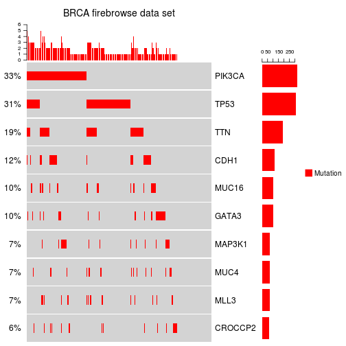
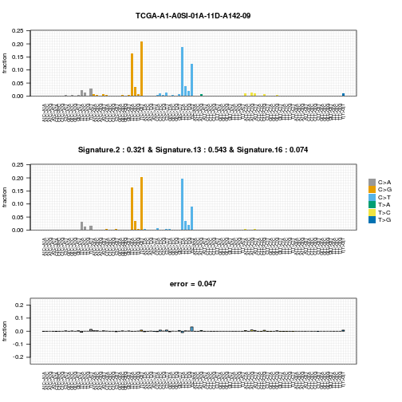
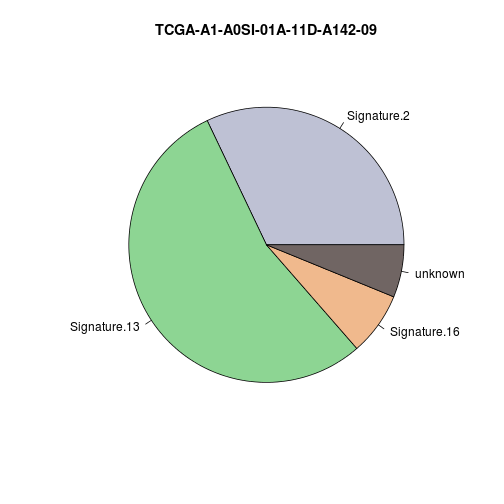
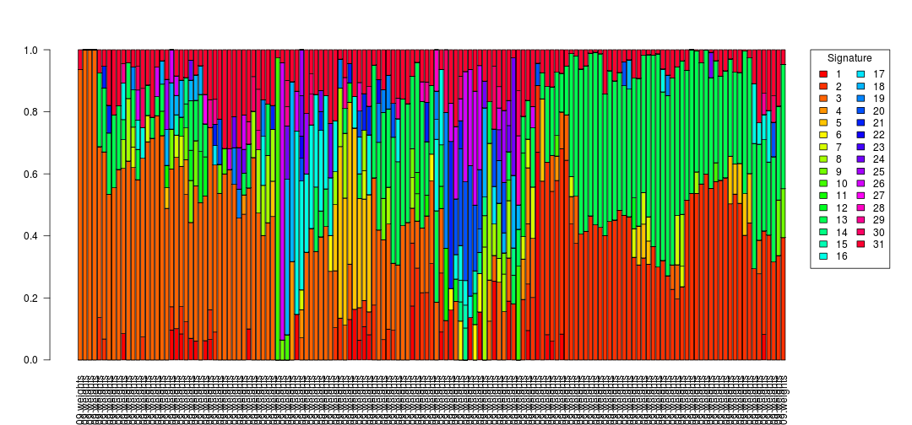

# Introduction
This practical consists of two parts: First, it will walk you through how to summarize and visualize mutations in cohort for a subset of genes. Second, it will show you how to calculate the weights for pre-defined mutational signatures in your samples. We will perform all the analysis in R using the ComplexHeatmap and the deconstructSigs packages.
We will work with the Breast Invasive Carcinoma (BRCA) SNV data set downloaded from [Firebrowse](http://firebrowse.org). There is one MAF-file (as specified on the [TCGA wiki-page](https://wiki.nci.nih.gov/display/TCGA/Mutation+Annotation+Format+%28MAF%29+Specification) containing the predicted SNVs for each sample. 
# Loading the data into R
First we need to load and merge the different files into a data frame in R. The list.files function can retrieve all filenames in a directory that contain a specific pattern. In our case all filenames should end with maf.txt. Since it is handy to get the full file name (including the directory name) we set full.names=TRUE. 


```r
# list all maf files in the download directory
dirname <- "gdac.broadinstitute.org_BRCA.Mutation_Packager_Calls.Level_3.2016012800.0.0/"
files <- list.files(dirname, pattern="*.maf.txt$", full.names=TRUE)
# inspect
#head(files)
#length(files)
```

There are 
982
MAF files. The ldply-function in the plyr package is very useful if one would like to load and concatenate several files. The function will load each file into a data.frame and then merge the data.frame based on the column names.


```r
# load one file after the other and concatinate to a large data frame
# NOTE: all input files should have the same structure
library(plyr)
data <- ldply(files, read.delim)
# inspect
#dim(data)
#head(data)
#sort(table(data$Tumor_Sample_Barcode))
#table(data$Variant_Type)
```

The resulting data.frame has
90490
mutations/rows. Note, that these are a mix of SNVs and small insertions and deletions. We can see that the number of mutations range from 
1
to
5707
mutations per sample. With a median of 
44
mutations per sample, a sample having 
5707
seems suspicious. At this point, we might want to inspect carefully those outliers and, if necessary, filters sample where we have reason to suspect quality or other issues that would make the sample incomparable to the rest of the cohort.
# Plotting a gene x patient mutation heatmap
Now that we have settled on and loaded a cohort that we wish to analyse, we will look for frequently mutated genes among the cohort and inspect the distribution of mutations in these genes across the patients. We will use the function oncoPrint in the ComplexHeatmap package to do so. 
## Selection the top mutated genes
But first we need to define which genes to plot. You can imagine any kind of small gene list that you might be interested in. We will select the top-10 most frequently mutated genes:


```r
# make sure we have each mutated gene listed only once per sample
unique_genes_bysample <- sapply(split(data$Hugo_Symbol, data$Tumor_Sample_Barcode), unique)
# for each gene, calculate the number of samples with a mutation in the gene 
nrsamples_bygene <- table(unlist(unique_genes_bysample))
# select the top 10 most mutated genes
top10genes <- names(tail(sort(nrsamples_bygene), n=10))
top10genes
```

 [1] "CROCCP2" "MLL3"    "MAP3K1"  "MUC4"    "GATA3"   "MUC16"   "CDH1"   
 [8] "TTN"     "TP53"    "PIK3CA" 

We see some well known cancer genes being among the top mutated genes. 
## Preparing the input for oncoPrint
We will now create a gene by patient matrix whose entries will indicate whether a certain gene is mutated ("MUT" entry) in a sample or not ("" as entry). As explained in their [vignette, oncoPrint](https://www.bioconductor.org/packages/devel/bioc/vignettes/ComplexHeatmap/inst/doc/s8.oncoprint.html) can visualize more than one type of alteration for each gene. For simplicity, we will plot a heatmap that contains only one type of mutation. Further, there are two options to represent the input for oncoPrint - have a look into the vignette and see which one is more intuitive for you.


```r
# get the sample names
samplenames <- unique(data$Tumor_Sample_Barcode)
# initialize a gene by sample matrix
mat <- matrix("", ncol=length(samplenames), nrow=length(top10genes), dimnames=list(top10genes, samplenames))
# go through all genes and change the entry to "MUT" if a gene is mutated in a particular sample
for(gene in top10genes){
	# get the samples that have a mutation in the gene
	mutated_samples <- as.character(data[data[,1]%in%gene, "Tumor_Sample_Barcode"])
	# set the entries in the matrix to "MUT"
	mat[gene, mutated_samples] <- "MUT"
}
# inspect
# head(mat)
```

Next, we will need to make a mapping from the possible entries in the matrix to a function that gives the geometric representation of the mutation type. The non-mutated entries (indicated as "") will be called "background" in the list, otherwise the names in the list correspond to the mutation type names used in the matrix above (in our case only "MUT"). Here is an example:  


```r
# define a style map for each type of mutation
alter_fun <- list( background = function(x, y, w, h) { grid.rect(x, y, w-unit(0.5, "mm"), h-unit(0.5, "mm"), gp = gpar(fill="lightgrey", col = NA)) },
		MUT = function(x, y, w, h) { grid.rect(x, y, w-unit(0.5, "mm"), h*0.33, gp = gpar(fill="red", col = NA)) })
```

In the example both, mutations and backgrounds will be drawn as rectangles. We will see that mutations will have rectangle that is only a third of the height of the background rectangle (indicated by h*0.33) and will be red while the background will be lightgrey.
## Plot the gene by patient mutation heatmap
Now we are almost ready to plot the heatmap, we just need to fill in the parameters as described below: 


```r
library(ComplexHeatmap)
oncoPrint(mat, 
	get_type = function(x) x, # how to get the different types of mutations for each entry in the matrix; in our case there are just two types "" and "MUT"
    	alter_fun = alter_fun, # to represent each mutation type in the plot; a mapping from mutation name to a function
	col=c("MUT"="red"), # legend color of the mutation types; should match what is given in alter_fun
	column_title = "BRCA firebrowse data set", # a title
	heatmap_legend_param = list(title = "", at = c("MUT"), labels = c("Mutation"))) # some labels for the legend
```



The heatmap shows a small rectangle if the gene (row) is mutated in the sample (column). Above the heatmap we see how many of the genes are mutated in each sample (this will be split by mutation type in case you have more than one mutation type). To the left of the heatmap we see the percent of sample that have a mutation in the gene. The barplot on the right shows the total number of samples that have a mutation in a particular gene (which will also be split into different mutation types if you have more than one). 
## Exercises
* Go to the firebrowse website and look at the results of MutSig2CV under the results, significantly mutated gene section. Which of the frequently mutated genes are not among the significantly mutated genes detected by MutSig2CV? Look at the gene in the UCSC genome browser and make use of the additional data that is available there, can you speculate why mutations in these genes are not significant?
* In the heatmap change the color and the size of the rectangle indicating the mutated genes. Can you represent the mutated gene as a circle (see vignette)?
* Bonus - try to adjust the code to visualize SNVs, deletions or insertions (as indicated by the Variant_Type column) by different colors.

# Calculate the weight of mutational processes
In the second part of this practical we will estimate the weights of the mutational signatures in each of our sample. We will use the [COSMIC mutational signatures](http://cancer.sanger.ac.uk/cosmic/signatures) as a basis. According to the website, the mutational signatures were learned from 10,952 exomes and 1,048 whole-genomes across 40 distinct types of human cancer from various sources. The goal of the following is to estimate which of these mutational processes were active in each of the BRCA samples. We will use the package deconstructSigs for this.
## Preparing the input for deconstructSigs
For each mutation we need its tri-nucleotide context. The function mut.to.sigs.input calculates this context from the hg19 genome assembly by default. All we have to do is to make sure that we use the same chromosome names as in the genome assembly and then to hand over the data containing the sample names, chromosome, start and end position, as well as reference and alternative allele for each mutation


```r
# check if the chromosome names match what deconstructSigs expects 
unique(data[,"Chromosome"])
```

 [1] "10"         "12"         "3"          "2"          "17"        
 [6] "5"          "6"          "16"         "22"         "20"        
[11] "X"          "1"          "14"         "19"         "7"         
[16] "9"          "4"          "11"         "15"         "8"         
[21] "18"         "21"         "Y"          "MT"         "13"        
[26] "GL000209.1"

```r
# add "chr" to each chromosome name
data[,"Chromosome"] <- paste0("chr", data[,"Chromosome"])
# filter mutations on some chromosome (e.g. chrM or "random"-chromosomes)
data <- data[!grepl("GL|chrMT", data[,"Chromosome"]), ]
```

```r
# get the trinucleotide context of the mutations
library(deconstructSigs)
trinucs <- mut.to.sigs.input( data, 
				sample.id="Tumor_Sample_Barcode", # names of the corresponding columns in data
				chr="Chromosome", 
				pos="Start_Position", 
				ref="Reference_Allele", 
				alt="Tumor_Seq_Allele2")
```

```
## Warning in mut.to.sigs.input(data, sample.id = "Tumor_Sample_Barcode", chr = "Chromosome", : Some samples have fewer than 50 mutations:
##   TCGA-A1-A0SB-01A-11D-A142-09, TCGA-A1-A0SD-01A-11D-A10Y-09, TCGA-A1-A0SE-01A-11D-A099-09, TCGA-A1-A0SF-01A-11D-A142-09, TCGA-A1-A0SG-01A-11D-A142-09, TCGA-A1-A0SJ-01A-11D-A099-09, TCGA-A1-A0SM-01A-11D-A099-09, TCGA-A1-A0SN-01A-11D-A142-09, TCGA-A1-A0SP-01A-11D-A099-09, TCGA-A1-A0SQ-01A-21D-A142-09, TCGA-A2-A04N-01A-11D-A10Y-09, TCGA-A2-A04Q-01A-21W-A050-09, TCGA-A2-A04U-01A-11D-A10Y-09, TCGA-A2-A04V-01A-21W-A050-09, TCGA-A2-A04X-01A-21W-A050-09, TCGA-A2-A04Y-01A-21W-A050-09, TCGA-A2-A0CK-01A-11D-A228-09, TCGA-A2-A0CL-01A-11D-A10Y-09, TCGA-A2-A0CM-01A-31W-A050-09, TCGA-A2-A0CO-01A-13D-A228-09, TCGA-A2-A0CP-01A-11W-A050-09, TCGA-A2-A0CQ-01A-21W-A050-09, TCGA-A2-A0CS-01A-11D-A10Y-09, TCGA-A2-A0CU-01A-12W-A050-09, TCGA-A2-A0CV-01A-31D-A10Y-09, TCGA-A2-A0CZ-01A-11W-A050-09, TCGA-A2-A0D1-01A-11W-A050-09, TCGA-A2-A0D3-01A-11D-A10Y-09, TCGA-A2-A0D4-01A-11W-A019-09, TCGA-A2-A0EM-01A-11W-A050-09, TCGA-A2-A0EN-01A-13D-A099-09, TCGA-A2-A0EO-01A-11W-A050-09, TCGA-A2-A0EP-01A-52D-A22X-09, TCGA-A2-A0ER-01A-21W-A050-09, TCGA-A2-A0ES-01A-11D-A10Y-09, TCGA-A2-A0ET-01A-31D-A045-09, TCGA-A2-A0EU-01A-22W-A071-09, TCGA-A2-A0EV-01A-11W-A050-09, TCGA-A2-A0EW-01A-21D-A10Y-09, TCGA-A2-A0EX-01A-21W-A050-09, TCGA-A2-A0ST-01A-12D-A099-09, TCGA-A2-A0SU-01A-11D-A099-09, TCGA-A2-A0SV-01A-11D-A099-09, TCGA-A2-A0SW-01A-11D-A099-09, TCGA-A2-A0SX-01A-12D-A099-09, TCGA-A2-A0T1-01A-21D-A099-09, TCGA-A2-A0T2-01A-11W-A097-09, TCGA-A2-A0T3-01A-21D-A10Y-09, TCGA-A2-A0T4-01A-31D-A099-09, TCGA-A2-A0T7-01A-21D-A099-09, TCGA-A2-A0YC-01A-11D-A117-09, TCGA-A2-A0YD-01A-11D-A10G-09, TCGA-A2-A0YF-01A-21D-A10G-09, TCGA-A2-A0YI-01A-31D-A10M-09, TCGA-A2-A0YL-01A-21D-A10G-09, TCGA-A2-A1FV-01A-11D-A13L-09, TCGA-A2-A1FX-01A-11D-A13L-09, TCGA-A2-A1FZ-01A-51D-A17G-09, TCGA-A2-A1G0-01A-11D-A13L-09, TCGA-A2-A1G1-01A-21D-A13L-09, TCGA-A2-A1G4-01A-11D-A13L-09, TCGA-A2-A1G6-01A-11D-A13L-09, TCGA-A2-A259-01A-11D-A16D-09, TCGA-A2-A25C-01A-11D-A167-09, TCGA-A2-A25D-01A-12D-A16D-09, TCGA-A2-A25E-01A-11D-A167-09, TCGA-A2-A25F-01A-11D-A167-09, TCGA-A2-A3KC-01A-11D-A20S-09, TCGA-A2-A3KD-01A-12D-A20S-09, TCGA-A2-A3XS-01A-11D-A22X-09, TCGA-A2-A3XU-01A-12D-A22X-09, TCGA-A2-A3XW-01A-11D-A23C-09, TCGA-A2-A3XX-01A-21D-A23C-09, TCGA-A2-A3XZ-01A-42D-A23C-09, TCGA-A2-A4RX-01A-11D-A25Q-09, TCGA-A2-A4RY-01A-31D-A25Q-09, TCGA-A2-A4S0-01A-21D-A25Q-09, TCGA-A2-A4S2-01A-12D-A25Q-09, TCGA-A7-A0CD-01A-11W-A019-09, TCGA-A7-A0CG-01A-11W-A019-09, TCGA-A7-A0CH-01A-21W-A019-09, TCGA-A7-A0CJ-01A-21W-A019-09, TCGA-A7-A0D9-01A-31W-A071-09, TCGA-A7-A0DB-01A-11D-A272-09, TCGA-A7-A13G-01A-11D-A13L-09, TCGA-A7-A13H-01A-11D-A228-09, TCGA-A7-A26E-01A-11D-A167-09, TCGA-A7-A26E-01A-11D-A272-09, TCGA-A7-A26F-01A-21D-A167-09, TCGA-A7-A26F-01B-04D-A22N-09, TCGA-A7-A26I-01A-11D-A167-09, TCGA-A7-A26I-01B-06D-A22N-09, TCGA-A7-A26J-01A-11D-A272-09, TCGA-A7-A26J-01A-11D-A167-09, TCGA-A7-A2KD-01A-31D-A21Q-09, TCGA-A7-A3IY-01A-21D-A21Q-09, TCGA-A7-A3J1-01A-11D-A20S-09, TCGA-A7-A425-01A-11D-A243-09, TCGA-A7-A426-01A-22D-A243-09, TCGA-A7-A4SB-01A-21D-A25Q-09, TCGA-A7-A5ZW-01A-12D-A29N-09, TCGA-A8-A06N-01A-11W-A019-09, TCGA-A8-A06O-01A-11W-A019-09, TCGA-A8-A06P-01A-11W-A019-09, TCGA-A8-A06R-01A-11D-A015-09, TCGA-A8-A06T-01A-11W-A019-09, TCGA-A8-A06Y-01A-21W-A019-09, TCGA-A8-A079-01A-21W-A019-09, TCGA-A8-A07F-01A-11W-A019-09, TCGA-A8-A07G-01A-11W-A050-09, TCGA-A8-A07I-01A-11W-A019-09, TCGA-A8-A07J-01A-11W-A019-09, TCGA-A8-A07O-01A-11W-A019-09, TCGA-A8-A07P-01A-11W-A019-09, TCGA-A8-A07U-01A-11W-A050-09, TCGA-A8-A07Z-01A-11W-A019-09, TCGA-A8-A082-01A-11W-A019-09, TCGA-A8-A083-01A-21W-A019-09, TCGA-A8-A086-01A-11W-A019-09, TCGA-A8-A08A-01A-11W-A019-09, TCGA-A8-A08B-01A-11W-A019-09, TCGA-A8-A08G-01A-11W-A019-09, TCGA-A8-A08H-01A-21W-A019-09, TCGA-A8-A08I-01A-11W-A019-09, TCGA-A8-A08J-01A-11W-A019-09, TCGA-A8-A08O-01A-21W-A071-09, TCGA-A8-A08P-01A-11W-A019-09, TCGA-A8-A08S-01A-11W-A050-09, TCGA-A8-A08T-01A-21W-A019-09, TCGA-A8-A08X-01A-21W-A019-09, TCGA-A8-A08Z-01A-21W-A019-09, TCGA-A8-A090-01A-11W-A019-09, TCGA-A8-A091-01A-11W-A019-09, TCGA-A8-A096-01A-11W-A019-09, TCGA-A8-A099-01A-11W-A019-09, TCGA-A8-A09B-01A-11W-A019-09, TCGA-A8-A09C-01A-11W-A019-09, TCGA-A8-A09D-01A-11W-A019-09, TCGA-A8-A09E-01A-11W-A019-09, TCGA-A8-A09K-01A-11W-A019-09, TCGA-A8-A09R-01A-11W-A019-09, TCGA-A8-A09T-01A-11W-A019-09, TCGA-A8-A09V-01A-11D-A045-09, TCGA-A8-A09X-01A-11W-A019-09, TCGA-A8-A0A1-01A-11W-A019-09, TCGA-A8-A0A2-01A-11W-A050-09, TCGA-A8-A0A4-01A-11W-A019-09, TCGA-A8-A0A9-01A-11W-A019-09, TCGA-A8-A0AB-01A-11W-A050-09, TCGA-A8-A0AD-01A-11W-A071-09, TCGA-AC-A23E-01A-11D-A159-09, TCGA-AC-A23G-01A-11D-A20S-09, TCGA-AC-A2BM-01A-11D-A21Q-09, TCGA-AC-A2FB-01A-11D-A17D-09, TCGA-AC-A2FE-01A-11D-A19Y-09, TCGA-AC-A2FF-01A-11D-A17D-09, TCGA-AC-A2FG-01A-11D-A17D-09, TCGA-AC-A2FK-01A-12D-A17W-09, TCGA-AC-A2FO-01A-11D-A17W-09, TCGA-AC-A2QH-01B-04D-A22N-09, TCGA-AC-A2QH-01A-11D-A18P-09, TCGA-AC-A3HN-01A-11D-A20S-09, TCGA-AC-A3OD-01A-11D-A21Q-09, TCGA-AC-A3QP-01A-11D-A22X-09, TCGA-AC-A3YI-01A-21D-A23C-09, TCGA-AC-A3YJ-01A-11D-A22X-09, TCGA-AC-A5EI-01A-11D-A27P-09, TCGA-AN-A03X-01A-21W-A019-09, TCGA-AN-A03Y-01A-21W-A019-09, TCGA-AN-A041-01A-11W-A050-09, TCGA-AN-A049-01A-21W-A019-09, TCGA-AN-A04A-01A-21W-A050-09, TCGA-AN-A0AM-01A-11W-A050-09, TCGA-AN-A0AS-01A-11W-A019-09, TCGA-AN-A0FD-01A-11W-A050-09, TCGA-AN-A0FF-01A-11W-A050-09, TCGA-AN-A0FK-01A-11W-A050-09, TCGA-AN-A0FN-01A-11W-A050-09, TCGA-AN-A0FS-01A-11W-A050-09, TCGA-AN-A0FY-01A-11W-A050-09, TCGA-AN-A0FZ-01A-11W-A050-09, TCGA-AN-A0G0-01A-11W-A050-09, TCGA-AN-A0XL-01A-11D-A10M-09, TCGA-AN-A0XO-01A-11D-A10G-09, TCGA-AN-A0XP-01A-11D-A117-09, TCGA-AN-A0XR-01A-11D-A10G-09, TCGA-AN-A0XS-01A-22D-A10G-09, TCGA-AN-A0XT-01A-11D-A10G-09, TCGA-AN-A0XV-01A-11D-A10G-09, TCGA-AO-A03L-01A-41W-A071-09, TCGA-AO-A03P-01A-11W-A019-09, TCGA-AO-A03R-01A-21W-A050-09, TCGA-AO-A03U-01B-21D-A10M-09, TCGA-AO-A0J5-01A-11W-A050-09, TCGA-AO-A0J7-01A-11W-A050-09, TCGA-AO-A0J8-01A-21D-A045-09, TCGA-AO-A0JA-01A-11W-A071-09, TCGA-AO-A0JC-01A-11W-A071-09, TCGA-AO-A0JE-01A-11W-A071-09, TCGA-AO-A0JF-01A-11W-A071-09, TCGA-AO-A0JI-01A-21W-A100-09, TCGA-AO-A0JJ-01A-11W-A071-09, TCGA-AO-A0JM-01A-21W-A071-09, TCGA-AO-A125-01A-11D-A10M-09, TCGA-AO-A126-01A-11D-A10M-09, TCGA-AO-A12A-01A-21D-A10Y-09, TCGA-AO-A12B-01A-11D-A10M-09, TCGA-AO-A12D-01A-11D-A10Y-09, TCGA-AO-A12F-01A-11D-A10Y-09, TCGA-AO-A12G-01A-11D-A10M-09, TCGA-AO-A12H-01A-11D-A10Y-09, TCGA-AO-A1KO-01A-31D-A188-09, TCGA-AO-A1KP-01A-11D-A13L-09, TCGA-AO-A1KS-01A-11D-A13L-09, TCGA-AO-A1KT-01A-11D-A13L-09, TCGA-AQ-A04J-01A-02W-A050-09, TCGA-AQ-A04L-01B-21D-A10M-09, TCGA-AQ-A0Y5-01A-11D-A14K-09, TCGA-AQ-A1H2-01A-11D-A13L-09, TCGA-AQ-A1H3-01A-31D-A13L-09, TCGA-AQ-A54O-01A-11D-A25Q-09, TCGA-AR-A0TS-01A-11D-A10Y-09, TCGA-AR-A0TY-01A-12W-A12T-09, TCGA-AR-A0U0-01A-11D-A10G-09, TCGA-AR-A0U2-01A-11D-A10G-09, TCGA-AR-A0U3-01A-11D-A10G-09, TCGA-AR-A1AJ-01A-21D-A12Q-09, TCGA-AR-A1AL-01A-21D-A12Q-09, TCGA-AR-A1AM-01A-41D-A228-09, TCGA-AR-A1AN-01A-11D-A12Q-09, TCGA-AR-A1AO-01A-11D-A12Q-09, TCGA-AR-A1AP-01A-11D-A12Q-09, TCGA-AR-A1AQ-01A-11D-A12Q-09, TCGA-AR-A1AR-01A-31D-A135-09, TCGA-AR-A1AS-01A-11D-A12Q-09, TCGA-AR-A1AT-01A-11D-A12Q-09, TCGA-AR-A1AU-01A-11D-A12Q-09, TCGA-AR-A1AV-01A-21D-A12Q-09, TCGA-AR-A1AW-01A-21D-A12Q-09, TCGA-AR-A1AX-01A-11D-A12Q-09, TCGA-AR-A1AY-01A-21D-A12Q-09, TCGA-AR-A24K-01A-11D-A167-09, TCGA-AR-A24L-01A-11D-A167-09, TCGA-AR-A24M-01A-11D-A167-09, TCGA-AR-A24N-01A-11D-A167-09, TCGA-AR-A24O-01A-11D-A167-09, TCGA-AR-A24P-01A-11D-A167-09, TCGA-AR-A24R-01A-11D-A167-09, TCGA-AR-A24S-01A-11D-A167-09, TCGA-AR-A24T-01A-11D-A167-09, TCGA-AR-A24U-01A-11D-A167-09, TCGA-AR-A24V-01A-21D-A167-09, TCGA-AR-A24W-01A-11D-A17G-09, TCGA-AR-A24X-01A-11D-A167-09, TCGA-AR-A24Z-01A-11D-A167-09, TCGA-AR-A252-01A-11D-A167-09, TCGA-AR-A254-01A-21D-A167-09, TCGA-AR-A2LH-01A-31D-A18P-09, TCGA-AR-A2LJ-01A-12D-A19Y-09, TCGA-AR-A2LK-01A-11D-A17W-09, TCGA-AR-A2LL-01A-11D-A17W-09, TCGA-AR-A2LM-01A-11D-A17W-09, TCGA-AR-A2LN-01A-21D-A18P-09, TCGA-AR-A2LO-01A-31D-A18P-09, TCGA-AR-A2LQ-01A-22D-A18P-09, TCGA-AR-A5QM-01A-11D-A27P-09, TCGA-AR-A5QN-01A-12D-A28B-09, TCGA-AR-A5QP-01A-11D-A28B-09, TCGA-B6-A0I2-01A-11W-A050-09, TCGA-B6-A0I5-01A-11W-A100-09, TCGA-B6-A0IA-01A-11W-A050-09, TCGA-B6-A0IB-01
```

At this point the function noticed that some of the samples have low numbers of mutations. Since we need a reliable estimate of the frequencies of mutations in their trinucleotide context, we might want to filter samples that have only few mutations. 


```r
# filter samples with few mutations
trinucs_selected <- trinucs[rowSums(trinucs)>100,]
```

## Run weight estimation
DeconstructSigs runs on a per-sample basis, hence we have to call whichSignatures on each sample separately with the input as indicated below. 


```r
# initialize a list of the length of samples 
results <- vector("list", nrow(trinucs_selected))
names(results) <- row.names(trinucs_selected)
# run the estimation of exposures for each sample and save the results in the list
for( sID in row.names(trinucs_selected) ){
	results[[sID]] <- whichSignatures(trinucs_selected, # the matrix generated with mut.to.sigs.input 
						sample.id=sID, # the current sample ID
						signatures.ref=signatures.cosmic, # the data.frame with the signatures that comes with deconstructSigs
						tri.counts.method="exome2genome", # which normalization method to use
						contexts.needed=TRUE) # set to TRUE if your input matrix contains counts instead of frequencies
}
```

The output for each sample contains:
* the estimated weights per signature (weights),
* the input (tumor),
* the fitted values (product) using the weights and the signatures (how much can be explained by the weights),
* the difference between the fit and the observed frequencies (diff), and
* the weight that cannot be explained by any of the signatures.
We can plot these entries for each sample:


```r
plotSignatures(results[[1]])
```



```r
makePie(results[[1]])
```



## Plot the cohort
If we want to compare the contribution of a mutational process across the samples of a cohort, it is common to represent this as a barplot where each bar is colored by the contribution of each mutational process to the observed mutational profile of a sample. First, we concatenate the weights per sample into a sample by signature matrix:


```r
# convert the exposures for each sample into a sample x signatures matrix
expo <- do.call("rbind", sapply(results, "[", 1))
# add the unknown value to the matrix such that the contributions add up to 1 per sample
Signature.unknown <- unlist(sapply(results, "[", 5))
expo <- cbind(expo, Signature.unknown)
```

```r
# reorder samples by similarity in their signature profiles
o <- row.names(expo)[hclust(dist(expo))$order]
# trick base graphics into putting the legend outside of the plot
par(mar=c(5.1, 4.1, 4.1, 8.1), xpd=TRUE)
barplot(t(as.matrix(expo))[,o], las=2, col=rainbow(31))
legend("topright", inset=c(-0.1,0), legend=1:31, fill=rainbow(31), title="Signature", ncol=2)
```



## Exercises
* Find the most common signatures among the sample. Use the signature with highest weight per sample and calculate the frequency of each signature across the cohort. Look up the top signatures on the COSMIC website. Do they make sense for BRCA data set?
