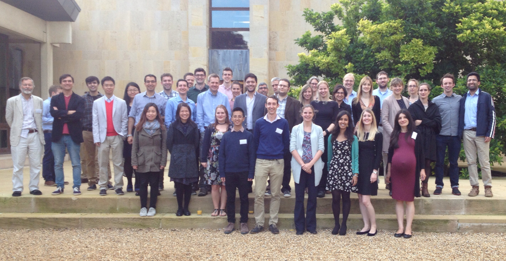

---
output:
  pdf_document: default
  html_document: default
---
# CRUK Bioinformatics Summer School 2017
# 24th - 28th July 2017

## Analysis of Cancer Genomes

# Overview

High-throughput technologies such as next generation sequencing (NGS) can routinely produce massive amounts of data. These technologies allow us to describe all variants in a genome and international collaborative efforts such as The Cancer Genome Atlas (TCGA) and International Cancer Genome Consortium (ICGC) have begun to catalogue and release data on genomic variation in a variety of cancer types.

However, such datasets pose new challenges in the way the data have to be analyzed, annotated and interpreted which are not trivial and are daunting to the wet-lab biologist. This course covers state-of-the-art and best-practice tools for the analysis of cancer genomes. We describe, and give hands-on experience of, the entire analysis workflow from raw data generated by a sequencing machine to deriving variant calls (SNVs, copy-number and structural variants) that are ready for downstream analysis and interpretation

# Audience

Enthusiastic and motivated wet-lab biologists who want to gain more of an understanding of NGS data and eventually progress to analysing their own data

# Pre-requisites

The course will include a great deal of hands-on work in R and at the command line. In order for you to make the most of the course we strongly recommend that you take an introductory course, or have sufficient experience in the following areas:-

- R
- Unix
- Introductory statistics

More specific requirements and references can be found here (http://www.cruk.cam.ac.uk/bioinformatics-course-prerequisites)

# Instructors

(all Cancer Research Uk Cambridge Institute)

- Mark Dunning, Bioinformatics Training Coordinator
    + http://markdunning.github.io/
- Matthew Eldridge, Bioinformatics Core Head
    + http://www.cruk.cam.ac.uk/core-facilities/bioinformatics-core
- Geoff Macintyre, Research Associate, Markowetz and Brenton labs
    + http://gmacintyre.com/
- Juliane Perner, Research Associate, Tavare lab
    + http://www.cambridgecancercentre.org.uk/users/julianeperner11162
- Oscar Rueda, Senior Research Associate, Caldas lab
    + http://www.cambridgecancercentre.org.uk/users/oscarrueda

# Aims

- Appreciation of the nature and scale of NGS data and the requirement for sophisticated computational methods
- Describe theory behind current methods for calling SNVs and copy-number changes from NGS data, and their outputs
- Encourage exploration of NGS data using interactive tools such the Integrative Genomics Viewer (IGV)
- Increase awareness of existing cancer cohorts and how they can be exploited

# Objectives

- Understand the main file formats used for NGS analysis (bam, vcf, bed etc), what is included in each file and appropriate tools for manipulating each file
- Know the metrics and tools that can be used to assess if a given sequencing run is adequate quality for analysis
- Understand the concepts and challenges involved in calling SNVs from whole-genome data
- Given a set of called SNVs, be able to 
    i) assess quantitively and qualitatively which calls might be "real" or not 
    ii) assess which calls might be biologically-meaningful and warrant further investigation
- Know how to access TCGA and ICGC data and how they can inform other studies

# Venue
- Craik-Marshall room, Department of Genetics, University of Cambridge
    + https://training.csx.cam.ac.uk/bioinformatics/venue/1122015
    
# Accommodation
If required, free bed and breakfast accommodation will be provided for attendees in Downing College - close to the course's location. Please let us know on the registration form if you need accommodation and when you plan to check-in and check-out. Please note that the course ends at 13:30 on Friday 28 July and accommodation is not provided for Friday night.

# Timetable

## Day Zero 18:00 - ..

- Informal get-together at The Grain and Hop Store (close to accomodation Downing College)
- Join us for a drink and dinner (self-paying), and to meet your colleagues for the next few days
    + http://www.grainandhopstore-cambridge.co.uk/

## Day One 09:30 - 17:00

- 09:30 - 10:00 [Course Introduction](Day1/Session1-intro.html)
- 10:00 - 11:30 [R crash course](Day1/Session2-Rnotes.nb.html)
- 11:30 - 12:30 [Overview of Cancer Genomics](Day1/CRUK summer school Intro V7 for web.pdf)
- 12:30 - 13:30 LUNCH (provided)
- 13:30 - 14:30 [Understanding raw sequencing reads](Day1/Session4-seqIntro.html)
- 14:30 - 15:00 [Understanding aligned reads](Day1/Session5-alignedReads.html)
- 15:00 - 16:00 [Introduction to IGV](Day1/Session6-IGV.html)
- 16:00 - 17:00 [Dealing with sequencing data in R](Day1/Session7-seqDatainR.nb.html)

## Day Two 09:30 - 17:00

- 09:30 - 10:30 [Calling Germline SNVs lecture](Day2/2017_SummerSchool_GermlineSNVs.pdf)
- 10:30 - 12:30 Calling Germline SNVs
    + [Calling Germline SNVs](Day2/vcf-intro.nb.html)
    + [Working with VCF Files](Day2/exploring-vcf.nb.html)
    + [Solutions to vcf exercises](Day2/vcf-solutions.Rmd)
- 12:30 - 13:30 LUNCH (provided)
- 13:30 - 17:00 Copy-number analysis
    + [Copy Number Analysis Lecture](Day2/copy_number_lecture.pdf)
    + [Copy Number Analysis Practical](Day2/practical_copy-number.html)
- 18:00 - .. Punting trip (weather permitting)
  
## Day Three 09:30 - 17:00

- 09:30 - 10:15 [Somatic SNV calling (lecture)](Day3/somatic_snv_calling.html)
- 10:15 - 10:45 [Somatic SNV calling (practical)](Day3/somatic_snv_calling_practical.html)
- 11:00 - 11:40 [SNV Filtering (lecture)](Day3/somatic_snv_filtering.html)
- 11:40 - 12:30 [Assessment and visualiation of SNVs (practical)](Day3/somatic_snv_assessment_exercise.html)
    + [Notes/solution for SNV assessment practical](Day3/somatic_snv_assessment_solution.html)
- 12:30 - 13:30 LUNCH (provided)
- 13:30 - 14:00 Summary of practical and discussion
- 14:00 - 14:30 [Annotating and prioritsing SNVs (lecture)](Day3/lecture_annotatingSNVs.pdf)
- 14:30 - 16:30 [Annotating and prioritsing SNVs (practical)](Day3/practical_annotatingSNVs.pdf)
- 16:30 - 17:00 [Somatic indels (lecture)](Day3/somatic_indels.html)
  
## Day Four 09:30 - 17:00

- 09:30 - 11:30 [Structural Variants](Day4/structural_variation.html)
- 11:30 - 12:30 [Introduction to data portals](Day4/links_to_portals.pdf)
- 12:30 - 13:30 LUNCH (provided)
- 13:30 - 14:00 [Mutational signatures lecture](Day4/lecture_signatures.pdf)
- 14:00 - 16:00 [Mutational signatures and cohort analyses (TCGA) practical](Day4/makeSignatures.html)
- 16:00 - 17:00 [Running an entire somatic calling pipeline with "docker"](Day4/docker-notes.html)

## Day Five (1/2 day) 09:30 - 12:30
- [Useful Resources](Day5/resources.md)
- 09:30 - 12:30  Open-ended;
    + Review results of a somatic-calling pipeline
    + Get advice on analysing your own data
    + Installing software on your own laptop
    + Completing exercises from previous days
    + Any other outstanding questions you might have
- 12:30 - 13:30 LUNCH (provided)

# Social Events

- The day before the course, you can join your instructors and fellow participants for a drink and dinner after your journey to Cambridge
- The workshop dinner will be held in Downing College on Day Four; dress code is smart casual. Please inform us of any dietary requirements when you register. The dinner is free.
- (Weather permitting), we will have a [punting](http://www.scudamores.com/) trip on the evening of Day Two of the course
